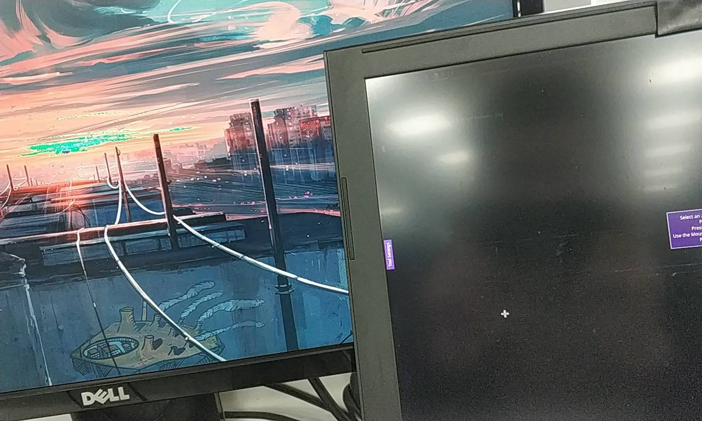

# archlinux

## command :coffee: 


- 更新密钥，`sudo pacman-key --refresh-keys`   
  - 重新加载，`sudo pacman-key --init `   `sudo pacman-key --populate`   
  - 清除缓冲文件，`sudo pacman -Scc`   `sudo pacman -Syu`   

```bash
https://mirrors.tuna.tsinghua.edu.cn/manjaro/stable/$repo/$arch
https://mirrors.sjtug.sjtu.edu.cn/manjaro/stable/$repo/$arch
https://mirrors.aliyun.com/manjaro/stable/$repo/$arch
```

### gpg管理 :old_key:  

1. 今天搞了下钥匙环。就是为了安全，pacman遇到不认识的签名时会询问是否从密钥服务器（/etc/pacman.d/gnupg/gpg.conf）下载。

- 因为有GFW，用了这个之后有点不方便，有些密钥就经常下载不下来。以下是从官网/论坛[找的服务器](https://en.wikipedia.org/wiki/Key_server_(cryptographic))，  

```shell
no-greeting
no-permission-warning
lock-never
keyserver-options timeout=10
keyserver-options import-clean
keyserver-options no-self-sigs-only
keyserver keyserver hkp://pgp.mit.edu:11371
keyserver hkp://pgp.mit.edu:11371
keyserver hkp://keyserver.kjsl.com:80
keyserver hkp://ipv4.pool.sks-keyservers.net:11371
# keyserver hkps://hkps.pool.sks-keyservers.net:443
```

- 然后还是不得行，有几个比如 fcitx5-chinese-addons，要更新，但是密钥和服务器却一直比对不上，就更新错误
	- 又翻了bbs资料，有说在[archlinuxcn] 下加上 `SigLevel = Optional TrustAll`   的，:older_man: 突然想到可以在别的下面也加上，不也是同样的道理吗
	- so, 我在 [extra] 和[community]  下面分别添加了这一行(ง •̀_•́)ง
	- 大杀招，对于信任的签名直接never，[package signing](https://wiki.archlinux.org/index.php/Pacman/Package_signing)  :blowfish:  ，成功了后面就无需做了
- 再次， `pacman-key --init && pacman-key --populate archlinux`  
	- 是早前导入的话，就需要refresh `pacman-key --refresh-keys`  （~~看运气，不能同步上key就结束掉~~）
	- 成功后，`yay -Syu`   就行了～，很明显，日志中有对更新情况说明（~~好像不是~~）

```verilog
[2020-08-26T15:26:28+0800] [ALPM] running '30-systemd-tmpfiles.hook'...
[2020-08-26T15:26:28+0800] [ALPM-SCRIPTLET] Detected unsafe path transition /var/log → /var/log/journal during canonicalization of /var/log/journal.
[2020-08-26T15:26:28+0800] [ALPM-SCRIPTLET] Detected unsafe path transition /var/log → /var/log/journal during canonicalization of /var/log/journal.
[2020-08-26T15:26:28+0800] [ALPM-SCRIPTLET] Detected unsafe path transition /var/log → /var/log/journal during canonicalization of /var/log/journal.
[2020-08-26T15:26:28+0800] [ALPM-SCRIPTLET] Detected unsafe path transition /var/log → /var/log/journal during canonicalization of /var/log/journal/b1b84058ab124b37b51ae65b2d9aa4ea.
[2020-08-26T15:26:28+0800] [ALPM-SCRIPTLET] Detected unsafe path transition /var/log → /var/log/journal during canonicalization of /var/log/journal/b1b84058ab124b37b51ae65b2d9aa4ea.
[2020-08-26T15:26:28+0800] [ALPM-SCRIPTLET] Detected unsafe path transition /var/log → /var/log/journal during canonicalization of /var/log/journal/b1b84058ab124b37b51ae65b2d9aa4ea.
[2020-08-26T15:26:28+0800] [ALPM-SCRIPTLET] Detected unsafe path transition /var/log → /var/log/journal during canonicalization of /var/log/journal/remote.
[2020-08-26T15:26:28+0800] [ALPM-SCRIPTLET] Detected unsafe path transition /var/log → /var/log/journal during canonicalization of /var/log/journal/b1b84058ab124b37b51ae65b2d9aa4ea/system.journal.
[2020-08-26T15:26:28+0800] [ALPM-SCRIPTLET] Detected unsafe path transition /var/log → /var/log/journal during canonicalization of /var/log/journal/b1b84058ab124b37b51ae65b2d9aa4ea/system.journal.
```

- 所以，感觉不是很推荐gpg key, 一来是有GFW，二来一些软件的key匹配不上，╮(￣▽￣)╭

2. 万能的V站，发现了线索，:laughing: 

- `gpg --keyserver keys.gnupg.net --search-keys CFDF148828C642A7`   
  - 这个key是在下载软件的时候，打印出来，提示需要verify的，
- `yay -S libxft-bgra`  

- **说到底，还是keyserver的key没有成功导入。**而且，这行command在官网也有

> 官方开发者和 TU 的密钥已经被主密钥签名认证，所以不需要用 pacman-key 认证它们。pacman 遇到不认识的签名时，它将会询问是否从密钥服务器（设置在`/etc/pacman.d/gnupg/gpg.conf`文件中，或在命令行中使用`--keyserver`选项）下载。

- [pacman/Package signing简体中文](https://wiki.archlinux.org/index.php/Pacman_(%E7%AE%80%E4%BD%93%E4%B8%AD%E6%96%87)/Package_signing_(%E7%AE%80%E4%BD%93%E4%B8%AD%E6%96%87))),  [keyserver receive failed:No name](https://bbs.archlinux.org/viewtopic.php?id=233362),  [issues updating my linux kernel](https://bbs.archlinux.org/viewtopic.php?id=257620),   

---

## yay软件包管理


- `yay -Ss rofi`   查询AUR内软件包
- `yay -S rofi`  
- `yay -Q rofi`   查询本地软件包
  - `yay -Ql vsftpd`   查看vsftpd服务的相关文件 
  - yay -Q后，按TAB键位，可以查看到相关参数
- `yay -Syy`     同步数据库的包  `yay -Syu`   升级所有安装的包
- `yay -Rns rofi`   删除包
- `yay -Scc`     清理缓存
- `yay -Yc`     清理不需要的依赖
- `sudo pacman -Rdd package_name`   需要删除旧的软件包，这个包又被其他的包依赖。命令可以跳过依赖检查

## 添加blackarch源&同步&软件

- `vim /etc/pacman.conf `   添加源

```shell
[blackarch]
Server = https://mirrors.ustc.edu.cn/blackarch/$repo/os/$arch
# 当然要和上面的[archlinuxcn] 一致也是可以的
```

- `yay -Sy`   同步数据库，
- `yay -S blackarch-keyring`   ,`yay -Ss dirb`   就可以看到来自blackarch仓库源里的软件了
  - `yay -S dirb `   `yay -S blackarch/dirb`   `yay -Q dirb `   

## 连接wifi

1. `systemctl start NetworkManager`   enable
2. `nmcli device wifi list `   
3. `nmcli d wifi connect "sipingsoft2020" password "Tianfucccccc"`   ping 进行测试

---

## 常用 :frog: 


1. 安装autojump后，提示  zsh: command not found j 

- 在~/.zshrc  文件中修改，plugins=(git autojump)
- 执行 zsh  ，就可以了
- 使用zsh， 如果出现通配符无法匹配的问题，编辑  ~/.zshrc  添加  setopt nonomatch,  source 生效

2. 在st 里面，和vim 里面，使用$mod(Alt)+c 实现复制，Fn+Shift+Inserrt实现粘贴
3. $mod+f，实现当前终端/窗口的全屏

- $mod+左Shift+j，实现终端的字体调小（临时）；  +k字体调大
- $mod+shift+空格，将当前窗口设置为悬浮模式，按住$mod+鼠标可以拖动该窗口
- $mod+r，进入调整窗口模式，使用方向键可以调整当前窗口大小
- $mod+shift+数字键，将当前窗口移动到指定工作区

4. 固定程序只能出现在某一个workspace，需要设置CLASS  `yay -S xorg-xprop`   

- `xprop | grep CLASS`   然后，鼠标点击需要固定的程序，得到CLASS参数，再编辑  ~/.config/i3/config 即可

6. 使用了flame-shot 来截图，~/.config/i3/config 中添加配置，实现$mod+p快捷键操作截屏
7. 


## 关于把笔记本带回家就不能启动这

- 在公司，使用的方式为：笔记本+外接公司的显示屏。在周五将笔记本带回家后，尝试将笔记本+外接 mini hdmi显示屏，但是就一直停留在 “Start version  ***” 启动界面

1. 后面，去了官网bbs，有大佬帮助了解答，参考，[官网bbs](https://bbs.archlinuxcn.org/viewtopic.php?id=11014)，  
   1. 还有，[nvidia的wiki](https://wiki.archlinux.org/index.php/NVIDIA_(%E7%AE%80%E4%BD%93%E4%B8%AD%E6%96%87))，  
   2. 所以说，启动盘一定保存好。那里面分区都搞好了，无需重新弄，直接挂载

2. 这就算是可以在家正常启动笔记本了~
3. **不过外接那块小显示屏，还是没搞好！！！！！**  

- **补充：**  

1. 在启动界面上，按e  去掉quiet 参数，ctrl+x 启动。发现一直停留在[ OK ] Finished TLP system startup/shutdown *** 字样处
2. 在这个界面，使用ctrl+f3，能够进入tty模式，root用户登录，再安装一下其他的软件包...  

---

- 后续是，我将笔记本带回到公司，准备外接 公司的显示屏。

1. 发现1：笔记本不外接显示屏时，不能正常启动进系统。。。估计还是nvidia的驱动的问题，于是乎，安装了一下nvidia相关的软件包，

```bash
pacman -S nvidia-lts
pacman -S xf86-video-intel
pacman -S xf86-video-vesa
# pacman -S extra/nvidia
pacman -S xf86-video-nouveau
pacman -S nvidia-beta
```

2. 可以用笔记本正常进入系统了。

---

- **但是！！！！！**  

1. 我在用HDMI 线外接公司显示屏时，发现可以连上，不过显示屏的颜色异常了，是那种黑白的，彩色显示异常 :seedling: :seedling: :seedling:  
2. **估摸着还是nvidia驱动的问题，**  
   1. 或者还是说，我之前并没有使用nvidia显卡？？？ :dizzy_face:  
   2. 安装官方推荐的驱动，`yay -S nvidia-3400xx-lts`  

3. 时间线往前捯，，，，
   1. 笔记本的arch系统，是在公司安装的，当时就一个笔记本（未使用外接）。可能后面有安装什么也说不定。

---

- 总有爱折腾的大神，参考[可能是arch分支最正确的显卡驱动方案](https://www.bwsl.wang/arch/67.html)，  


## 与windows远程 :desktop_computer: 


- `yay -Ss rdesktop`   
- `rdesktop -u Administrator -p "Ch188732316)" 221.236.xx.70:3389`   
  - `rdesktop -g 1440x900 -P -z -x l -r sound:off -u windowsuser 192.168.31.xx:3389`   
- 效果还行，开启后，远程就占用了一个终端的位置。不过就是，需要从另一标签页进来（不进远程）才能开一个终端


- **还有就是需要，**在windows 下的控制面板-系统-远程设置-“仅允许运行使用网络级别身份验证的远程桌面的计算机连接（建议）”，勾勾去掉，否则就会报错

```shell
Core(warning): Certificate received from server is NOT trusted by this system, an exception has been added by the user to trust this
specific certificate.
Failed to initialize NLA, do you have correct Kerberos TGT initialized ?
Failed to connect, CredSSP required by server (check if server has disabled old TLS versions, if yes use -V option)
```

- 参考，[rdesktop  from archlinux](https://wiki.archlinux.org/index.php/Rdesktop),  
  - 可以搞一个脚本，或者alias 别名来实现快速操作远程主机

## 指纹识别！！！！！

1. 笔记本重装archlinux， 计划使用上自带的指纹开关，
2. 参考，[fprint](https://wiki.archlinux.org/index.php/fprint),  
3. 

---

## i3wm xrandr扩展屏

1. `xrandr |grep connected `   找到已经连接的那块屏幕，我这里就是HDMI-1-3

- `xrandr --output HDMI-1-3 --auto --left-of eDP-1`  ，将扩展屏点亮

2. 将内容移动到扩展屏，可i3上操作类似，$mod+shift+方向键
3. 在使用时发现，可以这么理解，就**是将那块workspace工作区 给移动到扩展屏来了~**
4. `xrandr --output HDMI-1-3 --primary`   意思是，将扩展屏作为主屏幕，当每次新建ws时，都会在扩展屏上创建

---

1. 在使用中，发现，可以先在你计划使用的workspace中放置一个terminal,比如放在扩展屏中，这样就比较容易分配了～

---

##### 外接显示屏，色彩异常

- 在把家里的archlinux系统的笔记本带到公司，很不幸地发现，外接显示屏上的色彩，显示异常了！！！！！


- 然后在笔记本用hdmi线外接显示屏的情况下，使用flameshot截图，出现显示正常的情况。



1. 后面就不断地在wiki上找驱动，安装nvidia驱动，然后就安装了 [optimus-manager](https://wiki.archlinux.org/index.php/NVIDIA_Optimus)  ，就可以切换nvidia独显了。:herb:  [wiki](https://wiki.archlinux.org/index.php/NVIDIA)上第一句就是。。。。

- 切换操作，

1. `optimus-manager --switch nvidia`  切换nvidia独显，外接显示屏也就点亮了。
   1. `optimus-manager --switch intel`  
   2. xrandr 查看，此时会发现connected 的设备名称都和之前不一样了。我的 ~/.xprofile  文件内容如下：

```bash
fcitx5 &
# i3wm 增加扩展屏
xrandr --output eDP-1-1 --primary
xrandr --output HDMI-0 --auto --left-of eDP-1-1
```

2. 综合上面几点，估计原因是，独显nvidia 没有**正常**启动起来，导致的问题


## i3lock 像素化锁屏

1. `vim ~/.zshrc`   添加函数，lockscr

```shell
function lockscr(){
    /usr/bin/flameshot full -p ~/pics/backg/
    sleep 2
    convert ~/pics/backg/2020-*.png  -scale 10% -scale 1000% ~/pics/backg/2020-lock.png
    i3lock -i ~/pics/backg/2020-lock.png
    rm -f ~/pics/backg/2020-*.png
}
```

- 接着，st（终端） 里调用下，注意，解锁密码就是你用户的密码，直接输入然后 Enter
- 确定无误后，在i3配置文件中添加命令
    - `bindsym $mod+Shift+l exec "source ~/.zshrc && lockscr"`  

## 蓝牙无线使用

1. bluetoothctl 进行调试，

- `yay -Ql pulseaudio-bluetooth`   
- `systemctl status bluetooth`   

- `remove 5C:C6:E9:40:AC:1D`  
- `scan on `   重新扫描
- `pair 5C:C6:E9:40:AC:1D`   
- `connect 5C:C6:E9:40:AC:1D`   会有successful 成功显示

2. 参考，[官方wiki](https://wiki.archlinux.org/index.php/Bluetooth)，  


## TLP电池管理

1. `systemctl status tlp.service`   

- `vim /etc/tlp.conf `  ,添加  SATA_LINKPWR_ON_BAT="max_performance"
- `yay -S powertop`   安装powertop,查看所有设备的点亮消耗情况～

2. Linux的电池消耗可以等于（或超过）Windows，这完全取决于您的用法和管理方法。

2. 参考，[官方wiki](https://wiki.archlinux.org/index.php/TLP_(%E7%AE%80%E4%BD%93%E4%B8%AD%E6%96%87))，  

## 连接数据库图形化

1. 使用 DBeaver Community,来连接

- `yay -S dbeaver`  

2. 本地运行docker内数据库，做测试

- `docker run -d -p 3306:3306 --name mysql  -v /opt/mysql/mysql-data/:/var/lib/mysql -e MYSQL_DATABASE=myblog -e MYSQL_ROOT_PASSWORD=123456 mysql:5.7`  
- 

## st(simple terminal)！！！！！

1. `wget https://dl.suckless.org/st/st-0.8.4.tar.gz`  下载官方包
2. 使用到的补丁，可以参考网上其他人的

```shell
-rw-r--r-- 1 liuzel01 root 4.7K Mar  5  2019 st-alpha-0.8.2.diff
-rw-r--r-- 1 liuzel01 root 3.0K Feb  4  2019 st-copyurl-20190202-0.8.1.diff
-rw-r--r-- 1 liuzel01 root 2.5K Jun  6 19:42 st-hidecursor-0.8.3.diff
-rw-r--r-- 1 liuzel01 root 8.7K Apr 26  2020 st-scrollback-20200419-72e3f6c.diff
```

3. `patch < patch/st-scrollback-xxxx.diff`   打补丁

- 参考，[patch给文件打补丁](https://www.codesocang.com/jquerymobile/linux/3/18.html)，  

4. 实际上，st是可以实现终端到外部的复制的。

- 鼠标选中终端上内容就是复制，粘贴的实现方式是通过鼠标中键。所以说是可以在配置中解决的。

- **不过这个。还是需要改下配置！！！！！**  

## 其他记录 :triangular_ruler: 


1. `grep -i paste.*$ ~/st/config.h`   以任意字符结尾，

- `grep -i ^.*paste ~/st/config.h`   以任意字符开头，  ~~其实grep就已经是在匹配行了~~

2. `yay -Ss htop `   `yay -S htop`   

### git

- `git branch -v`   查看分支
- 

### linux挂载windows共享文件

1. `yay -S samba`   archlinux配置与windows文件共享

- 实现了，非root用户也可对共享文件进行编辑并保存，可以的~
- **这是因为用户属于root用户组，！！！！这种情况非常不安全，而且删除文件时没提示。。。**  
- 

```shell
需要现在windows（主机名DESKTOP-GU5AA0B）上共享一个文件夹，文件夹路径为C:\siping\newOneFiles\file
# //DESKTOP-GU5AA0B/file /home/liuzel01/windows cifs username=liuzel01,password=Tianfuc11,guest,x-systemd.automount 0 0
//DESKTOP-GU5AA0B/file /home/liuzel01/windows cifs x-systemd.automount,rw,iocharset=utf8,username=liuzel01,password=Tianfuc11,file_mode=0775,dir_mode=0775 0 0
```

- 前往参考，[systemd.mount中文手册](http://www.jinbuguo.com/systemd/systemd.mount.html)，[samba服务实现linux与windows相互共享资源](https://www.jianshu.com/p/830f1bd5b5e0)  ，

  [configuring fstab based samba share mounts](https://discourse.osmc.tv/t/configuring-fstab-based-samba-share-mounts/38167/9),  


---


### :thinking::thinking: 

1. 我的PC，通过线连接显示屏，PC+显示屏，

- [x] 这样的话，PC就要重装系统，装成arch
- [ ] 8G内存，会不会有点卡
  - [ ] **买根8G内存条，成16G运存**  
- [ ] 

2. 之后，将公司的台式主机，（因为有主机名，可以在网络上找到），挂载到我的PC上面来，

- [x] 这样的话，主机的磁盘空间就作为公司项目资料的存储空间，而自己电脑也不需要存储太多文件

  - ~~但是，16G内存，1TSSD，又有点亏~~

- [x] 还可以，当成远程来使用

3. 可以，将笔记本重装为archlinux系统，然后和公司电脑 显示器放一起工作，

- [ ] ，并且公司主机挂载到笔记本

4. 目前是双系统，win10+archlinux，启动顺序在BIOS 中更改，

- [ ] 将archlinux连接到显示屏，做工作机，不过只做一下工作，不做存储用。
- [ ] 先用着
- [ ] 再，将原有win10 卸载掉

---

2. 保证开发环境、测试环境、生产环境的一致性，

- 避免本地打包，线上打包出现问题


---

# FAQ 

## 在更新时，出现报错

### 问题描述：

- `error failed to commit transaction(conflicting files)`   `Error installing repo packages`   

### 解决方法：

1. 使用命令覆盖这个包，`sudo yay -Syu --overwrite /usr/lib/python3.8/xxx/ `  

- 貌似只写最外层的目录即可，

2. 第二种方法，手动~~删掉~~ 备份/删掉提示的包，再进行更新系统，

- 亲测有效。请确保目标包不被其他重要的包所依赖，可以去官网查看是否有冲突

## 在挂载windows文件时，不稳定

1. 固态硬盘，nvme0n1 可能会出现不稳定的情况，

- 有时候会出现，开机的时候，报错，[failed] failed to mount /boot/efi  ,
- 不过手动重启后，就能重新进去了  :confused::confused:  

2. ~~发现也并不是扩展屏的问题，估计是 /etc/fstab  文件里的挂载配置有点问题！~~

- 应该是用户liuzel01 对于目录 /etc/samba 的权限权限

---

1. **目前做法是，将/etc/fstab 的有关配置注释掉，笔记本启动成功后，再次手动挂载** 

- 后面，又好使了。。。
- ~~要解决，还是再看下配置~~  
- 要参考，[官网](https://wiki.archlinux.org/index.php/Samba_(%E7%AE%80%E4%BD%93%E4%B8%AD%E6%96%87)#As_systemd_unit)，  

## :thinking:  

## 有时候进不了目录

- 在挂载的windos文件夹内创建git,但是现在如果要进入目录，有很大概率，只能使用root身份才能进入目录了！:children_crossing:  
  - 不过，在将用户加入到root组内后，就可以

1. 解决了！！！！这是因为使用的终端st的问题，从官网下载最新的，就行了

- 然后，因为是c语言，有些配置的细节方面需要改改！！！！！


1. 欢迎前往wiki，[阅读i3](https://wiki.archlinux.org/index.php/i3#Workspace_variables)，  

2. A^a^A  


