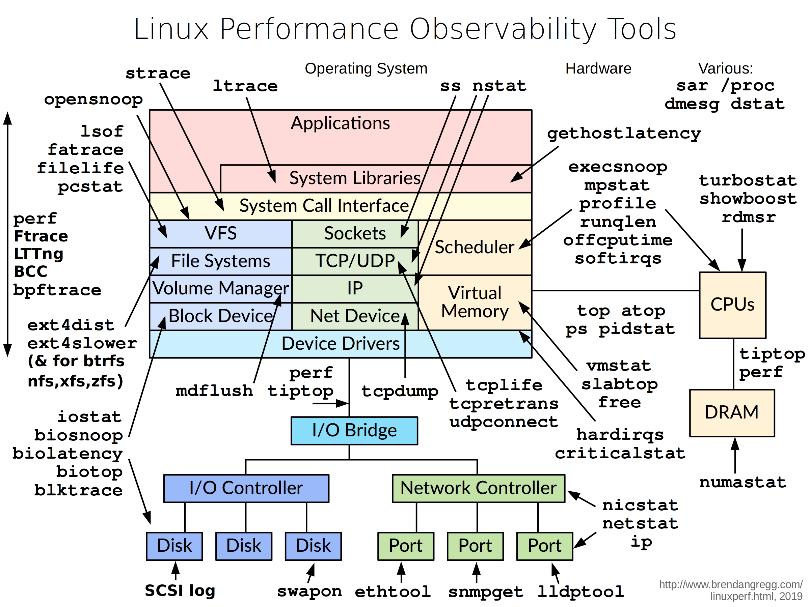
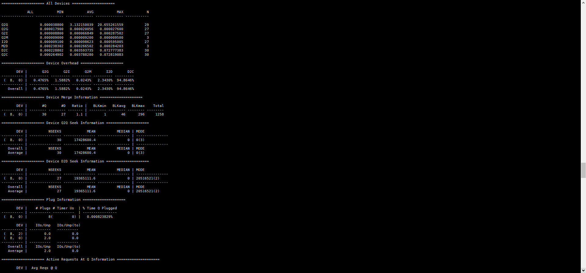
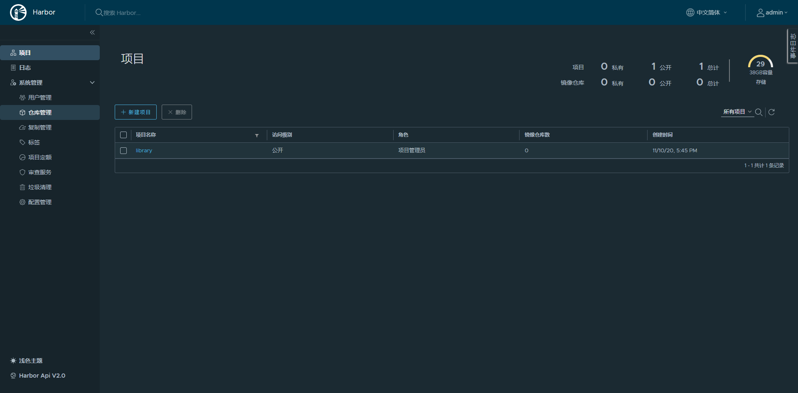
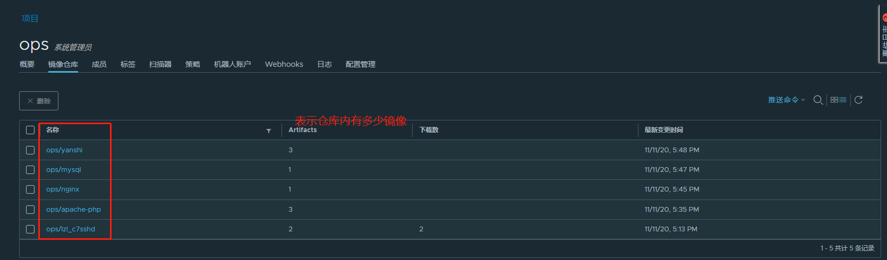
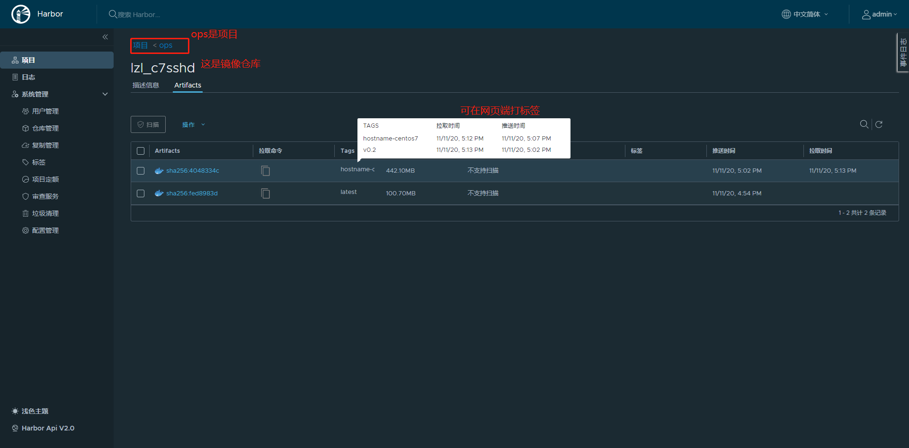
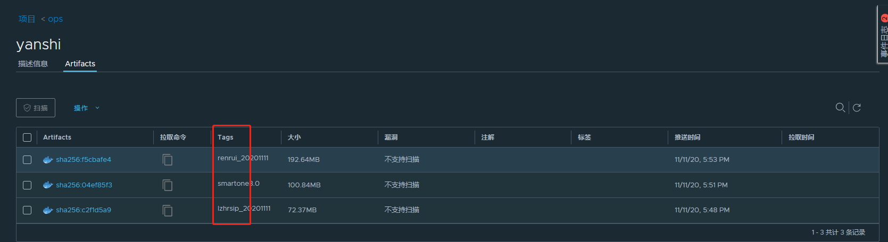
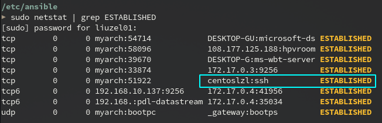

# centos7

# ops_运维

- 技能图，



1. 图片来源，[这里](http://www.brendangregg.com/linuxperf.html)，  

## 命令解释

##### htop

- 界面是酱婶儿滴，


1. 按h 查看帮助信息
2. 按F2， 可以配置界面中的显示信息


3. 按F5查看进程树，
4. 按F6 进行按需排序
5. 按u 显示指定用户的进程
6. F7调大优先级，F8调小优先级（增大nice值），这就涉及到了linux进程优先级
   1. 越大的nice值意味着优先级越低。相比于那些高nice值（低优先级）的进程来说，低nice值（高优先级）的进程可以获得更多的处理器时间
   2. 总结就是，会叫的孩子有奶吃，越是不nice的进程越有CPU优先使用权，也就是优先级高咯

6. 空格键，用于标记选中的进程，实现对多个进程同时操作

##### strace

##### blktrace

- blktrace是一个用户态的工具，提供I/O子系统上时间如何消耗的详细信息，从中可分析是IO调度慢还是硬件响应慢等。

1. `blktrace -w 120 -d /dev/sda`  
2. `blkparse -i sda -d blkparse.out`  将分析结果输出到屏幕，并且将分析结果的二进制数据输出到blkparse.out文件
3. `btt -i blkparse.out`  btt查看IO的整体情况，-i指定文件名

- 可参考，[华为的鲲鹏性能优化](https://support.huaweicloud.com/tuningtip-kunpenggrf/kunpengtuning_12_0036.html)  



##### bcc

- 使用 `/usr/share/bcc/tools/execsnoop`  来追踪你的代码。

1. 打开另一个端口运行命令，在 /usr/share/bcc/tools/execsnoop  下面就会有相应的输出。
2. 通过exec() 系统调用来工作，exec()通常用于在新进程中加载不同的程序代码

## lvm扩容

- 虚拟机使用lvm扩容，基本步骤如下：

1. 新添加一块磁盘，大小40G，
   1. `lsblk`,  
2. 对新磁盘分区
   1. `fdisk /dev/sdb`，  注意type，改成lvm
3. pvcreate， 创建物理卷
   1. `pvcreate /dev/sdb`  `pvs`  
4. 将新创建的pv卷，添加到vg组内；lvcreate  创建逻辑卷
   1. `vgextend centos /dev/sdb`  
   2. `lvcreate -l 100%FREE -n newsdb centos`  `lvs`  
5. 创建挂载点，挂载
   1. `mkdir -p /newsdb`,  `mount /dev/mapper/centos-newsdb /newsdb`  
   2. 如果挂载点为已存在的文件夹，那该文件夹内的内容就会没了，因为/dev/mapper/centos-newsdb  毕竟是空的。umount 掉即可
6. 要扩容 / 根目录，lvextend 将空间100% 加入到root逻辑卷内
   1. 在上面第4步骤，不要创建新卷，而是  `lvextend -l +100%FREE /dev/centos/root`，  就可以看到LV Size 成功增大了
   2. `xfs_growfs /dev/centos/root`，  重新识别下分区大小，`df -hT`  就可以看到效果了
   3. 成功对 / 根目录扩容~

---


# git:chestnut:  

##  常用操作

- `git status `  用于显示，工作目录和暂存区的状态。

1. 可以看到哪些修改被暂存到了，哪些没有，哪些文件没有被git tracked 到。
2. 不显示，已经commit到项目历史中去的信息。看项目历史的信息用`git log`  

- `git diff `  ，用来找当前工作目录和上次提交与本地索引间的差异（最简单快捷）

1. `git diff --stat `  ，统计一下哪些文件被改动，有多少行被改动，就可以使用stat 参数。而不是看每个文件的详细差别
2. `git diff --cached`  ，查看在下次提交时要提交的内容
3. `git diff dev`  ，查看当前的工作目录与另外一个分支的差别
   1. 也可以加上路径限定符，来只比较某一个文件或目录。	`git diff HEAD -- ./lib`  

- `git config --global user.name "liuzel01"`  

1. `git config --global user.email "liuzelin01@outlook.com"`  
   1. `git config -l`  
2. `git init`  
3. `git add .`  `git add ./xxx/`  
4. `git add -f <file>`  `git checkout --<file>`  撤销命令，这是相对的
5. `git commit -m "xxx"`  `git reset --hard + 版本号 `  ，这是相对的
6. `git remote add origin https://你的仓库地址.git`  
7. `git push -u origin master`  `git push -u origin dev`  
8. `git status`  `git diff`  `git reflog`  
9. `git rm`  
10. `git branch`  `git branch <新分支名字>`  `git checkout <分支名字>`  `git merge <分支名字>`  
11. `git merge --no-ff <分支名字>`  合并时禁用fast forward模式
12. `git branch -d <分支名字>`  删除分支，可能失败，git会保护未被合并的分支`git branch -D <分支名字>`  强行删除，丢弃没有被合并的分支
13. `git log --graph`  查看分支合并图
14. `git stash`  `git stash list`  `git stash apply`  `git stash drop`  `git stash pop`  
15. `git remote`  `git remote -v`  
16. `git rebase`  把分叉的提交历史显示成一条直线，看上去更直观
17. `git tag`  `git tag <标签名字>`  `git tag <标签名字> <版本号>`  
18. `git show <标签名字>`  `git tag -a <标签名字> -m "<标签说明>"`  
19. `git tad -d <标签名字>`  
20. `git push origin <标签名字>`  
21. `git push origin --tags`  <font color=orange>大橘为重</font>  
22. `git push origin :refs/tags/<标签名字>`  
23. `git config --global color .ui true`  
24. `git check-ignore -v <file>`  
25. 

---

- 本地仓库 = 工作区 + 版本区。

1. 工作区，即磁盘上的文件集合；版本区（版本库），即.git 文件；

2. 版本区 = 暂存区(stage) + 分支(master) + 指针(Head) 

---

- `git init`  在本地区域创建一个 .git 文件，版本区建立

1. `git add .`  表示把工作区的所有文件全部提交到版本区的暂存区，`git add ./xxx/`  逐条添加到暂存区
2. `git commit -m "xxx"`  把暂存区的所有文件提交到仓库区，暂存区空荡荡
3. `git remote add origin https://你的仓库地址.git`  把本地与远程仓库连接起来，只需连接一次，怪不得不常用
4. `git push -u origin master `  把仓库区的文件提交到远程仓库的master 里
   1. 不熟练，建议去远程仓库上刷新，看下效果
5. 提交后，立即查看工作区，git status 会显示类似，nothing to commit, working tree clean 

---

- 一般，**我都是用lazygit**, 在vscode上也能用，可视化，挺方便。~~当然，vscode上也能点点点~~  
- 下面的，理论大于实践

### 版本的回溯与前进

- `git rest --hard + 版本号`  来回溯，版本号用 `git log `  来查看
- **可以当成git 将这些版本串成一条时间线**  

1. 回溯之后，我想前进到最近的版本应如何？，`git reset --hard + 版本号`  来作，太艹了:joy:  反复横跳
2. `git reflog`  ，可以帮你找到你的版本号，防止弄丢了，然后又可以 `git reset `  来回穿梭了

######  版本控制

- 版本控制，revision control 是一种在开发的过程中，用于管理我们对文件/目录或是工程等内容的修改历史，方便查看更改历史记录，备份以便恢复以前的版本，的软件工程技术
- 简单说，就是用于管理，多人协同开发项目的技术

###### git 与 svn

- SVN是集中式版本控制系统，版本库是集中放在中央服务器的，而工作的时候，用的都是自己的电脑。所以，首先要从中央服务器获取最新的版本，然后工作。工作完成后，需要把自己做完的部分，推送到中央服务器。集中式版本控制系统，必须联网才能工作，对网络带宽要求较高
- git是分布式版本控制系统，没有中央服务器。每个人的PC就是一个完整的版本库，工作时无需联网。协同方式：A在PC上改了文件，B在自己PC上也改了同一份文件。这时，只需要把各自的修改推送给对方，就能看到对方的修改了。git能直接看到更新了哪些代码和文件。
- git是目前最先进的，分布式版本控制系统

###### 撤销

###### 删除

- 如若`git add . `  一个文件到暂存区，然后在工作区又把文件删除了，git会知道你删除了文件，要把版本库里的文件删除，需要

1. `git rm`  并且 `git commit -m "xxx"`  

- 如若误删了工作区的文件，要用到撤销命令，`git checkout --<file>`  
- 说明，撤销命令，其实就是用版本库里的版本替换工作区的版本，无论工作区是修改还是删除，都可以“一键还原”  

### 分支

- 在不使用其他分支时，每次 `git push -u origin master`  就是将时间轴往前推、
  - 这个应该不难理解，图我就不贴了

1. `git branch new01`  `git checkout new01`  创建新分支new01,切换到新分支
   1. `git branch`  查看当前所有分支，带* 的就是当前分支
2. 用new01提交，`git add ./xxx/`  或是 `git add -A` ，`git commit -m "xxx"`  
   1. -A, --all, --no-ignore-removal  
3. `git checkout master `  切换回master,
4. `git merge new01`  合并分支，这个时候就能看到new01 刚刚commit的信息了
5. `git branch -d new01`  删除new01 分支

###### 解决合并分支问题

- 

###### 分支管理

###### BUG分支

###### 删除分支

###### 多人协作

- 多人协作工作模式，通常为：

1. 首先，试图用 `git push origin new01`  推送自己的修改
2. 如若推送失败，则因为远程分支，比你的本地要新，需要先 `git pull`  试图合并
3. 如若合并有冲突，则解决冲突，并在本地提交
4. 没有冲突，或是解决掉冲突后，再进行 `git push origin new01`  推送就能成功
5. 如若 `git pull`  提示 `no tracking information`  ，说明本地分支，和远程分支的链接关系没创建，命令
   1. `git branch --set-upstream-to new01 origin/new01`  


###### rebase

### 标签

### 自定义git

### FAQ

- 参考链接，[git笔记](https://juejin.cn/post/6844903877138087950#heading-4)，  


# docker

1. 普通用户在使用时，添加进docker组即可，不需每次都输入密码，才能正常用docker命令

- `sudo usermod -G docker -a xiaobai`   `id xiaobai`   能看到用户小白的主组，以及附加组


- 更改后，需要切换或退出当前用户再重新登入，  `su - xiaobai`  ，才能成功

1. `docker images`   进行测试

2. 其中，usermod  命令，help中明确说明了，-g 以及-G的含义
   1. `-g, --gid GROUP               force use GROUP as new primary group`
   2. `-G, --groups GROUPS           new list of supplementary GROUPS`  新的补充清单

3. 查看容器的运行时日志，`docker logs --tail=100 -f process_exporter`   表示从第100行开始

4. dockerfile里用到的基础镜像，主要来自dockerhub官方人员制作维护的。如若要自己制作，可以参考，[create a base image](https://docs.docker.com/develop/develop-images/baseimages/),

   1. 这样意义不大，dockerhub上的基本都能找到，alpine 大小仅5M

---

- 在容器内使用systemctl，启动后台服务

1. docker 设计理念是在容器内不运行后台服务，容器本身就是宿主机上的一个独立的主进程，也可理解为是容器里运行服务的应用进程
   1. 因此，容器设计原则为，一个容器里运行一个前台服务
   2. 然后，其实可以通过不以root运行、不以特权模式运行来达到某些需求，实现更高容器安全
2. `docker run -itd --name lzl_c7 --privileged=true  -v /sys/fs/cgroup:/sys/fs/cgroup:ro 192.168.226.134/ops/lzl_c7sshd /sbin/init`  无需挂载cgroup 也是可以的

## 技巧

###### 将docker镜像体积减少99%！！！！！，有待补充

- 使用多阶段构建

1. 多阶构建，[可参考官方](https://docs.docker.com/develop/develop-images/multistage-build/)，

- 使用基础镜像

1. busybox，alpine
   1. 不过，在使用中，需要下载相对应的库，[ustc的](https://mirrors.ustc.edu.cn/alpine/v3.9/main/)，
      1. 在dockerfile，填写类似内容，RUN echo "https://mirror.tuna.tsinghua.edu.cn/alpine/v3.8/main" > /etc/apk/repositories
      2. 大多数linux发行版都是基于glibc的。在编译应用程序时，大部分都是针对特定libc进行编译的。如若要将他们与另一个libc一起使用，则必须重新编译他们。也就是说，基于alpine 构建的容器，可能会导致非预期的行为，因为标准C库是不一样的
   2. 还可以，使用类似golang:alpine 的镜像
2. 使用busybox:glibc 作为基础镜像。
   1. 包含glibc 和各种调试工具，适合来运行使用动态链接的程序
   2. sratch作为base image，调试起来会非常麻烦。虽然比上面两种少了那么几MB
3. 除了alpine，谷歌还提供[distroless](https://github.com/GoogleContainerTools/distroless)，如若在生产环境中运行并且更关心安全性，那么此选择更合适

---

- 镜像体积问题，一般在部署阶段（生产环境），要尽量小，秉承多快好省

1. 后续可以研究下

- dev环境，还是要让人快速上手使用为好


## 本地用数据库

1. DBeaver community 数据库连接工具，数据库地址172.17.0.1:3306 

- 其实也就是映射到本地端口的

2.`docker run -d -p 4406:3306 --name mysql -v /opt/mysql/mysql-data/:/var/lib/mysql -e MYSQL_DATABASE=tiny_wish -e MYSQL_ROOT_PASSWORD=123456 mysql:5.7-utf8`  

## 使用harbor 搭建私仓

### 常用命令

- harbor的生命周期管理，可以使用docker-compose 来管理，需要在harbor目录中执行
  - 当然，可以写成systemd服务来管理控制
- docker-compose，可以轻松、高效的管理容器，它是一个用于定义和运行多容器docker的应用程序工具。我说怎么有点熟悉。
  - docker compose  是单机管理docker的。k8s是多节点管理docker。虽然还有docker swarm也是多节点，不过基本已弃用

1. 启动：`docker-compose start`   
   1. `docker-compose up -d`  Create and start containers
2. 停止：`docker-compose stop`  
3. 移除：`docker-compose rm`  会保留相关镜像文件
   1. `rm -r /data/database`  `rm -r /data/registry`  删除数据
4. `docker-compose ps`  查看容器状态
5. `docker-compose down`  会删除容器，Stop and remove containers, networks, images, and volumes
   1. 删除后，`docker-compose ps `  你就看不到任何容器了。重新  `./install.sh`  重新安，

6. 如若说你pull下来的镜像，标签为none，那你可以在pull那条命令里看到，该容器的ID信息，
   1. 并且，`docker rmi 192.168.226.5/ops/centos7@sha256:c2f1d5a9c0a81350fa0ad7e1eee99e379d75fe53823d44b5469eb2eb6092c941`  

7. 给pull下来的镜像打标签，
   1. `docker tag 192.168.226.5/ops/lzl_c7sshd@sha256:c2f1d5a9c0a81350fa0ad7e1eee99e379d75fe53823d44b5469eb2eb6092c941  xxxlzl_c7sshd:lzlzlzlzl`  

---

#### 排查

1. 查看日志，`docker-compose logs log`  ，`docker-compose logs -f log`  
2. 授权，`chown -R root: /data`  `chown -R root: /var/log/harbor`  具体的路径在docker-compose.yml  文件中有


### 搭建

###### SSL证书创建

- SSL证书创建步骤，:chestnut:  

```bash
##################### 创建CA私钥
openssl genrsa -out ca.key 2048
##################### 制作CA公钥
openssl req -new -x509 -days 36500 -key ca.key -out ca.crt -subj "/C=CN/ST=BJ/L=BeiJing/O=BTC/OU=MOST/CN=liuzel01/emailAddress=ca@sipingsoft.com"
##################### 创建私钥
openssl genrsa -out httpd.key 1024
##################### 生成签发请求 
openssl req -new -key httpd.key -out httpd.csr -subj "/C=CN/ST=BJ/L=BeiJing/O=BTC/OU=OPS/CN=liuzel01/emailAddress=liuzel01@sipingsoft.com"
##################### 使用CA证书进行签发
openssl x509 -req -sha256 -in httpd.csr -CA ca.crt -CAkey ca.key -CAcreateserial -days 36500 -out httpd.crt
##################### 验证签发证书是否有效
openssl verify -CAfile ca.crt httpd.crt
##################### 最后，会显示： httpd.crt: OK
```

- 自签名证书不被浏览器信任，适合内部或者测试使用
- 将httpd.key httpd.crt 放到 /etc/harbor/cert 目录下，

###### 安装docker-ce

1. 

```bash
[root@master harbor]# docker --version
Docker version 19.03.13, build 4484c46d9d
```

###### 安装docker-compose

1. `wget https://github.com/docker/compose/releases/download/1.27.4/docker-compose-Linux-x86_64`  
2. `mv docker-compose-Linux-x86_64 /usr/bin/docker-compose`   
3. `chmod +x /usr/bin/docker-compose`  授权，
4. `docker-compose version`  查看打印出来的信息，能看到版本就ok的

- 或是直接，`yay -S docker-compose`  `which docker-compose`  

1. 能看到docker-compose是在 /usr/bin 目录下的，不要照搬网上的资料。所以猜测，上面直接下载软件包的方式其路径应该也是这里

```bash
[root@myarch liuzel01]# docker-compose version
docker-compose version 1.27.4, build unknown
docker-py version: 4.3.1
CPython version: 3.8.6
OpenSSL version: OpenSSL 1.1.1h  22 Sep 2020
```

###### 安装harbor私仓

1. 下载地址，[官网](https://github.com/goharbor/harbor/releases/download/v2.0.4-rc1/harbor-offline-installer-v2.0.4-rc1.tgz)， 

---

- 浏览器访问，https://192.168.226.134/harbor， 进入到页面内，账户密码在harbor.yml 中有的，harbor_admin_password

1. 在之前，还要配置一下daemon.json  内容如下，添加上ip:5000 harbor地址。
   1. 这是在客户端添加的，客户端http设置，通过此配置来取消docker默认不允许非https方式推送镜像 的限制。

```json
{
  "registry-mirrors":["https://3oxbtpll.mirror.aliyuncs.com"],
  "insecure-registries":[
    "192.168.226.134:5000","192.168.226.134"
  ],
  "live-restore":true
}
```

- 将harbor加入到systemd 服务中去，/usr/lib/systemd/system/docker_harbor.service

```bash
[Unit]
Description=Harbor
After=docker.service systemd-networkd.service systemd-resolved.service
Requires=docker.service
Documentation=http://github.com/vmware/harbor

[Service]
Type=simple
Restart=on-failure
RestartSec=5
ExecStart=/usr/bin/docker-compose -f /opt/harbor/docker-compose.yml up
ExecStop=/usr/bin/docker-compose -f opt/harbor/docker-compose.yml down

[Install]
WantedBy=multi-user.target
```

###### harbor使用



- 在docker push 之前，先登录上harbor，`docker login 192.168.226.134:5000 -uadmin`  ip就是你私仓的地址
  - 用户名/密码，需联系管理员在harbor 网页端后台进行创建，并将人员添加进对应的项目中去

- 而对于镜像仓库，不需创建，直接命令中tag 就好



1. 上传本地镜像到私仓，方法其实在harbor 端也有注解，
   1. `docker tag liuzel01/lzl_c7sshd:latest 192.168.226.134/ops/lzl_c7sshd:lzl_21`  
   2. `docker push 192.168.226.134/ops/lzl_c7sshd:lzl_21`  
      1. docker tag myblog 192.168.226.134/ops/lzl_django:lzl_django
      2. docker push 192.168.226.134/ops/lzl_django:lzl_django
   3. `docker tag SOURCE_IMAGE[:TAG] 192.168.226.5/ops/REPOSITORY[:TAG]`  网页端貌似没说加端口
      1. 因为上面已添加过，insecure-registrie，所以可行

- 注意harbor的架构。可以看到，好的tag能让你的镜像一目了然



 

- 从私仓push镜像，演示

1. `docker pull 192.168.226.134/ops/lzl_c7sshd:hostname-centos7`  或是 `docker pull 192.168.226.134/ops/lzl_c7sshd:V0.2`  
2. `docker pull 192.168.226.134/ops/lzl_c7sshd@sha256:4048334c3f3a455d746179aaf9f67c27e48bad642876d7456a191a69955595bd`  当然可以从harbor 复制命令过来执行
   1. lzl_c7sshd  是镜像仓库，hostname-centos7 是标签，这时候再回去看当时上传的操作，就很清晰了
3. 需要注意的是。当你将本地镜像push到私仓，而私仓已经有过了只是镜像的tag 不同，在harbor  页面就会给原有镜像添加你的tag
   1. 在你push的时候，会提示  `4cd45d454a89: Layer already exists`    就应该意识到这点

---

- 对于创建多个仓库，演示





- 参考，[harbor介绍与企业级私有docker镜像仓库搭建](https://cloud.tencent.com/developer/article/1718372)，  
- 参考，[使用harbor搭建docker私仓](https://www.jianshu.com/p/e896a2c7b975)，  [docker compose详解](https://www.jianshu.com/p/658911a8cff3)，  

1. [vmware harbor：基于docker distribution的企业级registry](https://segmentfault.com/a/1190000007705296)，  

---

### 高可用

- 市面上，所面临的问题

1. 中心化单实例，没有高可用
2. harbor数据存储在mysql容器中，无法保证其可靠性
3. 业务镜像数据存储在单机硬盘中，存在数据丢失的风险
4. 如若生产环境，在不同的城市区域有多个业务机房，存在跨机房，拉取镜像的请求

---

- 在提高系统高可用（High Availability），一般从这几个方面来设计：

1. **计算高可用**  
2. **存储高可用**  
3. 网络高可用
4. 其他方面

- 但是这个貌似要用到k8s,
- 方案1：独立的3个harbor实例+mysql Galera集群+镜像共享存储

> 3 个独立的 Harbor 实例，通过一个 Load Balancer 来做流量转发。同时采用了共享会话方式，把会话的信息保存在MySQL数据库中，这样无论哪个实例响应用户的请求，都不会丢失会话；
>
> 3 个 Harbor 的 Docker Registry 共享一个存放镜像数据的存储，例如阿里云 OSS、GlusterFS、NFS 等，可参考Harbor或Docker Distribution的文档配置；MySQL 由于不能共享存储，采用了 Galera 集群，这是一个多主的 MySQL 集群，每个节点均可读可写，同时支持同步复制数据，保证了高可用

- 方案2：独立的harbor子模块+mysql Galera集群+镜像共享存储

> 独立的 Harbor 子模块之间，通过负载均衡来通信，MySQL Galera 集群和镜像共享存储和方案 1 基本一样。
>
> 这个方案的优点是各个子模块相互独立，每个子模块都有 2 个备份，通过负载均衡实现高可用.
>
> 这里使用 Kubernetes Service 非常容易实现 LB，~~下面的章节会展开来说。~~  

---

- 参考，[解密360容器云平台的harbor高可用方案](https://xie.infoq.cn/article/e800dab85104da9ab7a223d7f)，[用harbor和k8s构建高可用企业级镜像仓库](https://mp.weixin.qq.com/s?__biz=MzkzMzE2ODg1MQ==&mid=2247489421&idx=1&sn=fe7c126dccaeda6a9c42d73e7e372722&source=41#wechat_redirect)，  

### FAQ

- ~~在停止后，`docker-compose stop`，  就很难启动起来，总会报错。。。。~~
  - ~~目前，是删除所有harbor相关镜像，再重新`./install.sh`  安装~~
  - ~~需要注意的是，在更改 harbor.yml后，建议是停止harbor,`docker-compose down`  启动使用，`./install.sh`~~

1. 不过，在使用  `systemctl start docker_harbor`  可以解决上面问题

---

## django应用容器化实践

- `vim Dockerfile`  

```
FROM centos:centos7.5.1804
LABEL maintainer="inspur_lyx@hotmail.com"
ENV LANG en_US.UTF-8
ENV LC_ALL en_US.UTF-8
# RUN 执行以下命令
RUN curl -so /etc/yum.repos.d/Centos-7.repo http://mirrors.aliyun.com/repo/Centos-7.repo
RUN yum install -y  python36 python3-devel gcc pcre-devel zlib-devel make net-tools
COPY nginx-1.13.7.tar.gz  /opt
#安装nginx
RUN tar -zxf /opt/nginx-1.13.7.tar.gz -C /opt  && cd /opt/nginx-1.13.7 && ./configure --prefix=/usr/local/nginx && make && make install && ln -s /usr/local/nginx/sbin/nginx /usr/bin/nginx
```

- `git clone https://gitee.com/agagin/python-demo.git`  

1. `mv python-demo myblog`  

2. `wget http://nginx.org/download/nginx-1.13.7.tar.gz`  

3. 基本准备工作就是这些

- `docker build . -t myblog -f Dockerfile`  
- `docker tag myblog 192.168.226.134/ops/lzl_django:lzl_django`  
- `docker push 192.168.226.134/ops/lzl_django:lzl_django`  

4. 然后，根据上传到私仓的 lzl_django 里的镜像来进行下一步

- `vim Dockerfile_optimized`  

```
FROM 192.168.226.134/ops/lzl_django@sha256:547b84f6b26af61004657c43c9045917a87a963ed7927476b315db4aff2db941
LABEL maintainer="liuzel01@hotmail.com"
#工作目录
WORKDIR /opt/myblog
#拷贝文件至工作目录
COPY ./myblog .
RUN cp myblog.conf /usr/local/nginx/conf/myblog.conf
COPY ./myblog/run.sh .
#安装依赖的插件
RUN pip3 install -i http://mirrors.aliyun.com/pypi/simple/ --trusted-host mirrors.aliyun.com -r requirements.txt
RUN chmod +x run.sh && rm -rf ~/.cache/pip
#EXPOSE 映射端口
EXPOSE 8002
#容器启动时执行命令
CMD ["./run.sh"]
```

5. 创建数据库

- `docker run -d -p 3306:3306 --name mysql  -v /opt/mysql/mysql-data/:/var/lib/mysql -e MYSQL_DATABASE=myblog -e MYSQL_ROOT_PASSWORD=123456 mysql:5.7`  
- 进入容器，登录数据库查看是否有 myblog

6. ！！！！！更改数据库字符集，因为最后发现发布文章会有问题，所以提前在这里记录下。
   1. 其实在前面Dockerfilexxxx 也能改。。。

- `vim mysql/my.cnf`  

```
[mysqld]
user=root
character-set-server=utf8
lower_case_table_names=1

[client]
default-character-set=utf8
[mysql]
default-character-set=utf8

!includedir /etc/mysql/conf.d/
!includedir /etc/mysql/mysql.conf.d/
```

- `vim mysql/Dockerfile`  

```
FROM mysql:5.7
COPY my.cnf /etc/mysql/my.cnf
```

- `docker build . -t mysql:5.7-utf8`  根据dockerfile 生成新镜像
- `docker tag mysql:5.7-utf8 192.168.226.134/ops/mysql:liuzel01_5.7-utf8`  
- `docker push 192.168.226.134/ops/mysql:liuzel01_5.7-utf8`  上传镜像到私仓
- `docker run -d -p 3306:3306 --name mysql -v /opt/mysql/mysql-data/:/var/lib/mysql -e MYSQL_DATABASE=myblog -e MYSQL_ROOT_PASSWORD=123456 192.168.226.134/mysql:5.7-utf8`  运行数据库

---

1. 启动 django

- `docker run -d -p 8002:8002 --name myblog_lzl -e MYSQL_HOST=172.17.0.4 -e MYSQL_USER=root -e MYSQL_PASSWD=123456  myblog:latest`  
- 如若不成功，注意你的运行docker环境的运存，不能太小

```
## migrate 迁移
$ docker exec -ti myblog bash
#/ python3 manage.py makemigrations
#/ python3 manage.py migrate
#/ python3 manage.py createsuperuser
## 创建超级用户
$ docker exec -ti myblog python3 manage.py createsuperuser
## 收集静态文件
## $ docker exec -ti myblog python3 manage.py collectstatic
```

2. 浏览器访问， 192.168.226.134:8002/admin   

---

- `docker run --rm -it -p 81:80 --name=phptest --hostname phptest -v /home/liuzel01/dockerfiles/lzhrsip/test:/var/www/html -w /var/www/html phptest:latest php test.php`  

- 有两种方式，

1. 第一种，在本地直接以命令行启动测试用项目。这种是便于自己在本地调试，容器即删即用，下面来举个例子。

2. 第二种，写dockerfile,docker build成自定义的镜像，然后启动运行即可；还可以传给别人，方便别人运行项目。这种是方便将环境打包，把比如demo类的传输给别人，并直接运行

​    2.1 定制一个自己用的自定义镜像，比方说添加上某些功能

- FAQ：

1. 某些容器启动不了项目，优先检查dockerfile,dcoker logs container_name,确保无错误后；就要思考是不是镜像选用错了。

​    1.1 毕竟，单单php镜像就有 php-cli,php-fpm,php-apache 等好多

2. 容器的端口一定要全部开放
3. 只要你选对image 后，一切都是那么丝滑


# prometheus--监控系统

## 几个unit file，:chestnut:  

- 如若你是部署服务的话，下面还是有必要参考的
- `cat /usr/lib/systemd/system/prometheus.service`  

```bash
[Unit]
Description=Prometheus
Documentation=https://prometheus.io/
After=network.target
[Service]
Type=simple
User=prometheus
ExecStart=/opt/prometheus/prometheus 					\
			--config.file=/opt/prometheus/prometheus.yml 	\
			--web.enable-lifecycle 				\
			--storage.tsdb.path=/opt/prometheus/data 	\
			--storage.tsdb.retention=60d
Restart=on-failure
[Install]
WantedBy=multi-user.target
```

- `cat /usr/lib/systemd/system/grafana-server.service`  

```bash
[Unit]
Description=Grafana instance
Documentation=http://docs.grafana.org
Wants=network-online.target
After=network-online.target
After=postgresql.service mariadb.service mysqld.service

[Service]
EnvironmentFile=/etc/sysconfig/grafana-server
User=grafana
Group=grafana
Type=notify
Restart=on-failure
WorkingDirectory=/usr/share/grafana
RuntimeDirectory=grafana
RuntimeDirectoryMode=0750
ExecStart=/usr/sbin/grafana-server                                                  \
                            --config=${CONF_FILE}                                   \
                            --pidfile=${PID_FILE_DIR}/grafana-server.pid            \
                            --packaging=rpm                                         \
                            cfg:default.paths.logs=${LOG_DIR}                       \
                            cfg:default.paths.data=${DATA_DIR}                      \
                            cfg:default.paths.plugins=${PLUGINS_DIR}                \
                            cfg:default.paths.provisioning=${PROVISIONING_CFG_DIR}  

LimitNOFILE=10000
TimeoutStopSec=20

[Install]
WantedBy=multi-user.target
```

- `cat /usr/lib/systemd/system/node_exporter.service`  

```bash
[Unit]
Description=node_exporter
After=network.target
[Service]
Type=simple
User=prometheus
ExecStart=/usr/local/node_exporter/node_exporter
Restart=on-failure
[Install]
WantedBy=multi-user.target
```

- `cat /usr/lib/systemd/system/process_exporter.service`  

```bash
[Unit]
Description=process_exporter
After=network.target
[Service]
Type=simple
User=prometheus
ExecStart=/usr/local/process_exporter/process-exporter -config.path /usr/local/process_exporter/config.yml
Restart=on-failure
[Install]
WantedBy=multi-user.target
```

- 查看 系统上所有已加载的服务，

1. `systemctl --type=service`  --state=active


## docker 部署

1. `docker run -d -p 9090:9090 -v /opt/prometheus/prometheus.yml:/etc/prometheus/prometheus.yml  -v /opt/prometheus/rules/node_alerts.yml:/etc/prometheus/rules/node_alerts.yml  --name prometheus -v /etc/localtime:/etc/localtime:ro --hostname prometheus prom/prometheus`   注意宿主机和容器内的时区

- 还可以指定本地数据存储的路径

2. `docker run -d -p 9100:9100 -v "/proc:/host/proc:ro" -v "/sys:/host/sys:ro" -v "/:/rootfs:ro" --net="host" --name node_exporter prom/node-exporter`   

- `curl 127.0.0.1:9100/metrics`   访问获取的指标

3. `docker run -d -p 9256:9256 --privileged -v /proc:/host/proc -v /opt/prometheus/process_exporter:/config --name process_exporter ncabatoff/process-exporter -config.path /config/config.yml  --procfs /host/proc  `   

- 有啥问题，直接[官网走起](https://github.com/ncabatoff/process-exporter)  

4. ` docker run -d -p 3000:3000 -v /opt/grafana-storage:/var/lib/grafana    --name grafana grafana/grafana`   

- <u>注意本机 /opt/grafana-storage 的权限，对于组外人的权限w</u>  

```yaml
prometheus.yml		# 注释部分都省略了
# my global config
global:
  scrape_interval:     15s # Set the scrape interval to every 15 seconds. Default is every 1 minute.
  evaluation_interval: 15s # Evaluate rules every 15 seconds. The default is every 1 minute.
# Alertmanager configuration
alerting:
  alertmanagers:
  - static_configs:
    - targets:
      # - alertmanager:9093
# Load rules once and periodically evaluate them according to the global 'evaluation_interval'.
rule_files:
  - "rules/node_alerts.yml"
# Here it's Prometheus itself.
scrape_configs:
  # The job name is added as a label `job=<job_name>` to any timeseries scraped from this config.
  - job_name: 'prometheus'
  	static_configs:  # 静态指定，targets中的 host:port/metrics 将会作为metrics抓取对象
  	file_sd_configs:  # 基于文件的服务发现，文件中（yml 和json 格式）定义的host:port/metrics将会成为抓取对象
  	- files:
  		- ./sd_files/docker_host.yml
	refresh_interval: 30s

  - job_name: '西藏项目_Linux'
    static_configs:
    - targets: ['192.168.10.167:9100','221.236.26.xx:9100']
  - job_name: '进程监控_linux'
    static_configs:
    - targets: ['192.168.10.167:9256','221.236.26.xx:9256']

  - job_name: '西藏项目_WinServer'
    static_configs:
    - targets: ['221.236.26.xx:9182']
```


---


1. 注意的是，prometheus.yml 文件中，如果监控本机，为了**避免问题**，写本机IP,否则在 prometheus/targets 页面会跳转不到metrics指标页面 那里

- 当然，很可能是 /etc/hosts 文件中的，主机名ip的对应没有配好！！！

2. 

## prometheus的联邦集群支持！！！！！（表示还有待补充）

1. 


## PromQL探索！！！！！

- 参考，[彻底理解Prometheus查询语法](https://blog.csdn.net/zhouwenjun0820/article/details/105823389) ， [大神的prometheus-book](https://yunlzheng.gitbook.io/prometheus-book/parti-prometheus-ji-chu/quickstart/why-monitor),  

- 使用到promQL的组件：

1. prometheus server
   client libraries for instrumenting application c7ode
   push gateway
   exporters
   alertmanager

### metric 介绍

- 类型
- label

### promQL表达式


## 四个黄金指标

Four Golden Signals 是google针对大量分布式监控的经验总结。可以在服务级别帮助衡量终端用户体验/服务中断/业务影响等层面的问题。参考上面的[prometheus-book](https://yunlzheng.gitbook.io/prometheus-book/parti-prometheus-ji-chu/promql/prometheus-promql-best-praticase),  

1. 延迟：服务器请求所需时间
2. 通讯量：监控当前系统的流量，用于衡量服务的容量需求
3. 错误：监控当前系统所有发生的错误请求，衡量当前系统错误发生的速率
4. 饱和度：衡量当前服务的饱和度

---

1. 参考，[10个常用监控k8s性能的prometheus oprtator指标](https://mp.weixin.qq.com/s/idQgb0GC2yhaVYwgGj5gcA)，  


## FAQ

1. ~~有个问题：~~  

- ~~docker部署的process_exporter，可以获取到指标数据，但是 在使用grafana 相应的仪表盘监控时，发现不到本机的process~~  
- 解决了！因为容器内的配置文件，并未生效。参考上面运行process_exporter的命令，以及github上README

2. 

## 杂项

1. 几款比较好的dashboard,去[官网copy id即可](https://grafana.com/grafana/dashboards)，  

- windows的表盘，windows_exporter for prometheus，id 10467

- linux的，node_exporter for prometheus, id 8919
  - system processes metrics, id 8378

2. 

### 优势-与常见监控的比较

1. 参考，上面的[prometheus-books](https://yunlzheng.gitbook.io/prometheus-book/parti-prometheus-ji-chu/promql/prometheus-promql-best-praticase),  
2. [prometheus替代IBM Monitoring（ITM）可行性分析](https://www.talkwithtrend.com/Article/246769)，  

## 使用go编写exporter！！！！！

- 参考，[使用Go开发prometheus exporter](https://mp.weixin.qq.com/s/s1nSaC-8ejvM342v5KPdxA)，  

1. 

# ansible 记录

1. `ansible centos_server -m ping `  在尝试连接过程中，会提示，**Permission denied (publickey,gssapi-keyex,gssapi-with-mic)** ，

- 修改 sshd_config 配置，增加，`PasswordAuthentication yes`

## ansible配置优化

##### 开启SSH长连接，

- `vim  /etc/ansible/ansible.cfg `   `ssh -V`   查看主机上ssh的版本，高于5.6则可以直接添加如下

```
[ssh_connection]
ssh_args = -o ControlMaster=auto -o ControlPersist=5d
```

- 表示设置整个长连接的保持时间，这里设置的是5天。
- 通过 `netstat | grep container`   能看到会有一个ESTABLISHED状态的连接一直与远端设备进行TCP连接



2. 如果要达到ssh长连接的目的，也可修改主机（控端/中控机）的sshd_config  配置，（没尝试）

```
ServerAliveInterval 30
ServerAliveCountMax 3
ControlMaster auto
ControlPath ~/.ssh/sockets/%r@%h-%p
ControlPersist 5d
```

---

##### 开启pipelining

- pipelining 也是openssh的一个特性，

1. ansible执行流程是这样的，	`▶ ansible centoslzl -m ping  -vvv`  结合命令来看更好看

- 基于调用的模块生成一个python脚本
- 将python复制到主机上
- 最后，在远端服务器上执行此python脚本

2. 同样是在 ansible.cfg  文件中，

```
[ssh_connection]	同样是此节点下
pipelining = True
```

3. 再次执行命令，能观察到打印出来的更少了，

- 少了一个PUT脚本和SFTP脚本去远端server的流程

##### ~~开启accelerate模式~~  

- 和SSH Multiplexing功能类似，accelerate 是使用python在远端server 运行一个守护进程，然后ansible通过这个守护进程监听的端口进行通信
- redhat官方目前不赞成使用accelerate模式，后面的版本中可能要被删除。:seedling:  

1. 需要中控机和远端server都安装 python-keyczar软件包

- `▶ ansible centoslzl -a 'yum install -y python-pyasn1 python python-crypto`  
- `  rpm -ivh ftp://ftp.ntua.gr/pub/linux/centos/7.8.2003/cloud/x86_64/openstack-queens/Packages/p/python-keyczar-0.71c-2.el7.noarch.rpm`  注意，这是centos7 的，如果是其他版本，需要自己识别
- 完成安装后，对 ansible.cfg 进行配置，

```
[accelerate]
accelerate_port = 5099
accelerate_timeout= 30
accelerate_connect_timeout= 5.0
```

##### 修改ansible执行策略

- 有个参数，默认值如下，修改修改成free  

```
# Ansible will use the 'linear' strategy but you may want to try another one.
#strategy = linear
strategy = free,	# 修改成free,
```

1. 默认值是linear,即按批次并行处理；  free 表示的是ansible会尽可能快的切入到下一个主机。所以在执行结果的task 显示顺序就不一样，也就可以理解了
2. playbook中的设置，

```
---
- hosts: all
   strategy: free
tasks:
...
```

##### 任务执行优化

- async，代表这个任务执行时间的上限值，即任务执行时间如果超出这个时间，则认为任务失败。
- 参数async未设置，则为同步执行。可以为执行时间非常长（有可能遭遇超时）的操作使用异步模式
- 为异步启动一个任务，可指定其最大超时时间以及轮询其状态的频率，如若没有为poll指定值，默认轮询频率10s

```
---
  - hosts: all
   remote_user: root
   tasks:
      - name: simulate long running op (15 sec), wait for up to 45 sec, poll every 5 sec
      command: /bin/sleep 15
      async: 45
      poll: 5
```

1. 有以下场景需要使用ansible的异步模式

- 某个tash需要运行很长时间，可能会达到ssh连接的timeout
- 没有任务是需要等待它才能完成的，即没有任务依赖此任务是否完成的状态
- 需要尽快返回当前shell的

2. 一些不适合使用异步模式的

- 这个任务需要运行完后，才能继续另外任务的
- **申请排他锁的任务（如yum）**  


##### 设置facts 缓存

- 在使用ansible-playbook 时，默认第一个task都是 GATHERING FACTS，表示 收集每台主机的facts信息，方便在playbook中直接引用facts里的信息。如若不需要facts的信息，可以在playbook 设置 

  `gather_facts: false`   提高playbook 效率

```
---
- hosts: 10.0.108.2
gather_facts: no
tasks:
...
```

- 也可以在 ansible.cfg  文件中添加如下配置，禁用facts采集

```
[defaults]
gathering = explicit
```

###### json文件缓存facts信息

###### redis缓存facts信息 

###### memcache缓存facts信息

- **未实践！！！**  

## ansible的日常维护使用

##### 利用ssh-agent提升ansible管控的安全性

- 可参考，[使用ssh和ssh-agent实现无密码登陆远程server](http://yysfire.github.io/linux/using-ssh-agent-with-ssh.html)，  


##### 配置ansible 变量环境

1. 编辑 /etc/profiles ，新增一行，`export ANSIBLE_CONFIG=/etc/ansible/ansible.cfg `  

2. 编辑 /etc/ansible/ansible.cfg  文件

```
[defaults]							# 此处只列出了defaults下的配置
inventory = /etc/ansible/hosts    	#主机列表配置文件
library = /usr/share/ansible/    	#库文件存放目录
remote_tmp = $HOME/.ansible/tmp   	#临时py命令文件存放在远程主机目录
local_tmp = $HOME/.ansible/tmp    	#本机的临时命令执行目录
forks = 50     						#默认并发数
sudo_user = root    				#设置默认执行命令的用户，root,可在playbook中重新指定该参数
# ask_sudo_pass = True    			#每次执行ansible命令是否询问ssh密码
# ask_pass = True
remote_port = 22    
# module_lang = C						#设置模块的语言
private_key_file = /root/.ssh/id_rsa	#设置中控机连接客户端的私有ssh-key文件位置
host_key_checking = False   		#检查对应服务器的host_key，建议取消注释，否则就得先一个一个主机连一次
timeout = 60						#设置ssh连接超时时间，单位s
log_path = /var/log/ansible.log   	#日志文件，也是建议取消注释
```

- 可参考，[ansible自动化运维体系在生产环境下实践](https://mp.weixin.qq.com/s?__biz=MjM5NTk0MTM1Mw==&mid=2650634947&idx=2&sn=6e7e72a60fba85ca7f044cd0a258c406&chksm=bef90445898e8d532b95b511810c19a116bf849b644b0fa0d4fa148fa8502e0cc81941225caf&scene=21#wechat_redirect)，  [语雀上ansible](https://www.yuque.com/liuzelin01/linux/linux-ansible#tMKYg)，  

---

##### 配置ansible客户端主机环境

1. 编辑  /etc/ansible/hosts 文件，按照如下格式添加控端

```
[业务系统名称代码_x86]
ip x.x.x.x
[业务系统名称代码_aix]
ip x.x.x.x
```

2. 这样可以区分不同业务系统，不同操作系统类别，

- `ansible 业务系统名称代码* -m module_name -a module_args`  
- `ansible 业务系统名称代码*_x86 -m module_name -a module_args `  

- `ansible *x86 -m module_name -a module_args `

##### 配置ansible ssh 通信

1. `ssh-keygen`  ,生成ssh public 和 private key
2. `for i in $ `cat /tmp/ansible_docker.txt`;do ssh-copy-id root@$i;done`  ，也可以写进脚本执行

- 这个时候需要输入密码，来建立互信过程。。
- **应该可以在脚本中，自动写密码的！！！！**  

##### 常用模块

1. 建议命令，`ansible-doc file`  这里面的都是-a 中可以跟的相关选项，

- 创建文件符号链接，`ansible centoslzl -m file -a 'src=/etc/resolv.conf dest=/tmp/resolv.conf state=link'`  

2. copy：复制文件到远程主机，

- 将本地文件复制到客户端，`ansible centoslzl -m copy -a 'src=/etc/ansible/ansible.cfg dest=/tmp/ansible.cfg owner=root group=root mode=0644'`  

3. command：在远程主机执行命令，因为默认就是command,所以`ansible centoslzl -a 'date' `  
4. shell：参数与上相同，不过可以用管道
5. service,cron,yum,synchronize,user,group
6. `ansible all -a 'hostname' `  

---

##### ansible tower（企业级的ansible）

1. ansible,简单学习一下yaml语法，jinja2语法，能懂得python代码用于分析问题就行。

- 熟练掌握python的话，都不是问题，ansible的一切都可以通过python来解释。

## 演练

1. **开始吧，展示！！！**  


# jenkins

## FAQ

##### active(exited)

1. `systemctl restart jenkins `   启动后不报错，看日志也未打印出，

- `systemctl status jenkins `   查询状态，同时刷新网页，一会就变成 active(exited)  了

- 解决办法：

1. 给用户jenkins授权，

- `chown -R jenkins: /var/lib/jenkins`  
- `chown -R jenkins: /var/cache/jenkins`  
- `chown -R jenkins: /var/log/jenkins `

2. 重启，并刷新网页  


# golang

## 国内go get无法下载的问题，

- `go get github.com/joho/godotenv`  下载总是超时  i/o timeout,

1. 解决方法：

- 使用国内七牛云或是阿里云的镜像仓库，
- `go env -w GO111MODULE=on`  `go env -w GOPROXY=https://goproxy.cn,direct`  
- 再次使用go get就可以了

2. 参考，[golang 1.13解决go get无法下载](https://www.sunzhongwei.com/problem-of-domestic-go-get-unable-to-download?from=sidebar_new)，  https://github.com/goproxy/goproxy.cn

---


# 技巧技巧 :medal_sports:  

## PC和手机快速文件传输

1. 使用python3的模块，`python3 -m http.server`   
2. 如果希望换个端口，`python3 -m http.server 1234 --bind 127.0.0.1`   绑定后就不能用本机ip访问
3. 可以不使用weixin等第三方工具，随时随地传

## 其他

1. `yay -S vnstat`   安装vnstat,监控网络流量

- 

# FAQ

1. 

